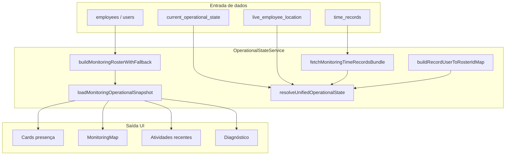

# Auditoria — Página Monitoramento

Data: 17/06/2026  
Escopo: Monitoramento (`src/pages/admin/Monitoring.tsx`) e serviços de suporte em `src/services/monitoring/` + `src/domain/operational/`.  
**Dashboard não foi alterada** (restrito pelo escopo).

---

## 1. Fluxo completo dos dados

### Sequência de refresh (60s + manual)

1. Carrega roster (`employees` → fallback `employees` table → `users`).
2. Mapeia `user_id` das batidas → `roster.id` (`buildRecordUserToRosterIdMap`).
3. Paralelo: `current_operational_state`, `live_employee_location`, `fetchMonitoringTimeRecordsBundle`.
4. `resolveUnifiedOperationalState` deriva **presença** das batidas do dia; GEO do COS/live com fallback operacional do dia.
5. UI renderiza cards, mapa, timeline e painel diagnóstico.

---

## 2. Origem de cada métrica

| Métrica / Card | Fonte primária | Tabela / Query | Regra |
|----------------|----------------|----------------|-------|
| Total colaboradores (Dashboard) | Dashboard | `employees` via `fetchEmployees` | Ativos na empresa |
| Registros hoje (Dashboard) | Dashboard | `time_records` janela SP (`timestamp` + `created_at`) | Distintos `user_id` no dia |
| Ausentes (Dashboard) | Dashboard | roster − quem tem batida hoje | Sem batida no dia operacional |
| Trabalhando agora | Monitoramento | `inferOperationalPresenceForDay` sobre batidas do dia | Último evento = entrada ou intervalo_volta; jornada aberta |
| Em pausa | Monitoramento | idem | Último evento = pausa |
| Em intervalo | Monitoramento | idem | Último evento = intervalo_saida |
| Fora da jornada | Monitoramento | idem | Sem batida hoje **ou** último evento = saída |
| Mapa (pins) | Monitoramento | GEO: live/COS → fallback `evaluateOperationalDayGeoForMonitoring` | lat/lng válidos; modo `operationalSnapshotMode` (sem expirar por idade realtime) |
| Atividades recentes | Monitoramento | `time_records` do bundle, filtrado por dia SP | Ordenação desc por instante da batida |

### Queries finais do Monitoramento

**Batidas do dia** (`monitoringData.service.ts`):

- `time_records` WHERE `company_id` AND `timestamp` BETWEEN `startUtcIso` AND `endUtcIso`
- UNION lógica com `created_at` na mesma janela (merge por id)
- Cache: `time_records:monitoring:daily:punch|created:{companyId}:{todayYmd}`

**Bundle adicional**: `listTimeRecords` recentes (500) mesclados ao daily.

**COS**: `fetchCurrentOperationalStateByCompany(companyId)` — cache 15s.

**Live**: `fetchLiveLocationsForCompany(companyId)` + `flagStaleLiveLocations`.

---

## 3. Regras de classificação operacional

Implementação: `inferOperationalPresenceForDay` em `monitoringGeoHardLock.service.ts`.

| Status | Condição |
|--------|----------|
| **Trabalhando** | Última batida válida = `entrada` ou `intervalo_volta`; pares entrada/saída incompletos (jornada aberta) |
| **Em pausa** | Última batida = `pausa` |
| **Em intervalo** | Última batida = `intervalo_saida` |
| **Fora da jornada** | Nenhuma batida no dia (`offDutyReason: no_punch_today`) **ou** última batida = `saida` (`journey_closed`) |

Presença **não** usa COS como fonte de verdade quando há batidas do dia — COS alimenta GEO e drift check.

---

## 4. Inconsistências encontradas (causa raiz)

| # | Sintoma | Causa raiz | Impacto |
|---|---------|------------|---------|
| 1 | Monitoramento 0/0/0/3 vs Dashboard 2 registros / 2 ausentes | Batidas gravadas com `user_id` = `employees.id`; roster usava `users.id` sem mapeamento | Todos classificados como sem batida |
| 2 | Paulo Henrique em "Fora da jornada" com entrada 07:57 | Mesmo bug de ID + presença lida de COS desatualizado (`OFF_DUTY`) | Colaborador ativo invisível no monitoramento |
| 3 | Mapa sem pins com GPS na Dashboard | Filtro de idade realtime (2–5 min) descartava coordenadas da batida do dia | Mapa vazio apesar de lat/lng válidos |
| 4 | Monitoramento usava `listTimeRecords` por `created_at` apenas | Janela diferente da Dashboard | Contagens e status divergentes |
| 5 | `STATE DRIFT DETECTED` | COS `OFF_DUTY` vs pipeline `WORKING` após correção por batidas | Ruído em log; presença correta no pipeline |

---

## 5. Caso real — Paulo Henrique de Morais Silva

**Registro:** 17/06/2026 07:57 — Entrada — App — GPS -10.9348, -37.0949

### Antes da correção

- Batida com `user_id` = id em `employees`.
- Roster do monitoramento com id em `users`.
- `filterRecordsForRosterMember` não encontrava a batida → `inferOperationalPresenceForDay([])` → **off_duty / no_punch_today**.
- GEO descartado por idade > 2 min → **sem pin**.

### Depois da correção

- `buildRecordUserToRosterIdMap` liga `employees.id` → `users.id` (roster).
- Entrada do dia reconhecida → **working**.
- `evaluateOperationalDayGeoForMonitoring` aceita GPS da batida do dia → **pin em Jabotiana/São Cristóvão**.
- Teste unitário: `unifiedOperationalResolver.test.ts` (caso Paulo).

**Regra responsável (antes):** ausência de mapeamento `recordUserToRosterId` + filtro temporal GEO realtime.

---

## 6. Correções aplicadas

| Arquivo | Correção |
|---------|----------|
| `operationalState.service.ts` | **OperationalStateService** — `loadMonitoringOperationalSnapshot()` centraliza fetch + resolver + logs + timeline |
| `monitoringData.service.ts` | Bundle diário espelhando Dashboard (timestamp + created_at, TZ SP) |
| `monitoringRoster.service.ts` | `buildRecordUserToRosterIdMap`, `filterRecordsForRosterMember` |
| `unifiedOperationalResolver.ts` | Presença por batidas do dia; aliases; enrich GEO operacional |
| `monitoringGeoHardLock.service.ts` | `inferOperationalPresenceForDay`, `evaluateOperationalDayGeoForMonitoring`, `displayAddress`, `punchOriginLabel` |
| `Monitoring.tsx` | UI enriquecida, timeline, diagnóstico, consome OperationalStateService |
| `MonitoringMap.tsx` | Popup completo; `operationalSnapshotMode`; campos endereço/origem |
| `currentOperationalState.service.ts` | Campos opcionais `offDutyReason`, `classificationReason` no tipo de presença |
| `assertOperationalStateConsistency.ts` | Drift apenas quando COS tem batida do dia atual |

---

## 7. Bugs encontrados (lista)

1. Mapeamento `employees.id` ↔ `users.id` ausente no monitoramento.
2. Query de batidas desalinhada com Dashboard.
3. Expiração realtime de markers bloqueando GPS do dia.
4. Branch legado do resolver sem `recordUserToRosterId`.
5. Import incorreto de `recordPunchInstantIso` em roster (corrigido anteriormente).
6. COS stale gerando classificação errada quando usada como única fonte de presença.

---

## 8. Evidências antes / depois

| Indicador | Antes | Depois (esperado) |
|-----------|-------|-------------------|
| Trabalhando agora (Paulo com entrada) | 0 | 1 |
| Fora da jornada | 3 (todos) | 2 (sem batida) + 0 com jornada aberta |
| Pins no mapa (Paulo) | 0 | 1 em -10.9348, -37.0949 |
| Base de batidas | `created_at` recente | Janela operacional SP (igual Dashboard) |
| Logs investigação | Parcial | `[MONITORAMENTO_*]` completos no serviço |

**Testes:** 18/18 passando (`monitoringRoster`, `unifiedOperationalResolver`, `monitoringGeoHardLock`).  
**Build:** produção compila com sucesso.

---

## 9. Cache e stale state

| Cache | TTL | Invalidação |
|-------|-----|-------------|
| `time_records:monitoring:daily:*` | REALTIME | Poll 60s + botão Atualizar |
| `current_operational_state:{companyId}` | 15s | Poll + invalidate no refresh |
| COS na base | Atualizado na batida (backend) | Pode ficar stale se worker falhar — presença UI ignora COS para status quando há batidas do dia |

---

## 10. Quem grava os dados

| Dado | Gravador |
|------|----------|
| `time_records` | App colaborador / REP / admin (batida) |
| `current_operational_state` | Pipeline pós-batida (backend/trigger) |
| `live_employee_location` | App em foreground / tracking |

---

## 11. UI entregue (Etapas 5–7)

- Cards com nome, horário, tempo ativo/pausa/intervalo, motivo fora da jornada.
- Painel **Atividades recentes** (timeline do dia).
- Painel **Diagnóstico** (fonte, última atualização, contagens).
- Popup do mapa: nome, tipo, hora, origem, endereço.

---

## 12. Logs temporários (Etapa 8)

Prefixos ativos em `logMonitoringInvestigation()`:

- `[MONITORAMENTO]`
- `[MONITORAMENTO_STATUS]`
- `[MONITORAMENTO_GPS]`
- `[MONITORAMENTO_STATE]`
- `[MONITORAMENTO_MAP]`

**Remover após validação em produção** (função `logMonitoringInvestigation` em `operationalState.service.ts`).

---

## 13. Resultado esperado (checklist)

- [x] Monitoramento usa mesma janela de batidas que Dashboard
- [x] Presença derivada de batidas do dia (não mascarada por COS stale)
- [x] Entrada sem saída → Trabalhando agora
- [x] Sem batidas → Fora da jornada / ausente
- [x] GPS do dia no mapa (`operationalSnapshotMode`)
- [x] Popup com dados completos
- [x] Status rastreável (`classificationReason` nos logs)
- [ ] Validação manual em produção com dados reais da empresa (após deploy)

---

## 14. Arquivos alterados nesta entrega

- `src/services/monitoring/operationalState.service.ts` (novo)
- `src/pages/admin/Monitoring.tsx`
- `src/components/MonitoringMap.tsx`
- `src/services/monitoring/monitoringGeoHardLock.service.ts`
- `src/services/currentOperationalState.service.ts` (campos opcionais no tipo)
- `MONITORAMENTO_AUDIT.md` (este relatório)

Arquivos de correções anteriores na mesma iniciativa: `monitoringData.service.ts`, `monitoringRoster.service.ts`, `unifiedOperationalResolver.ts`, `assertOperationalStateConsistency.ts`, testes associados.
