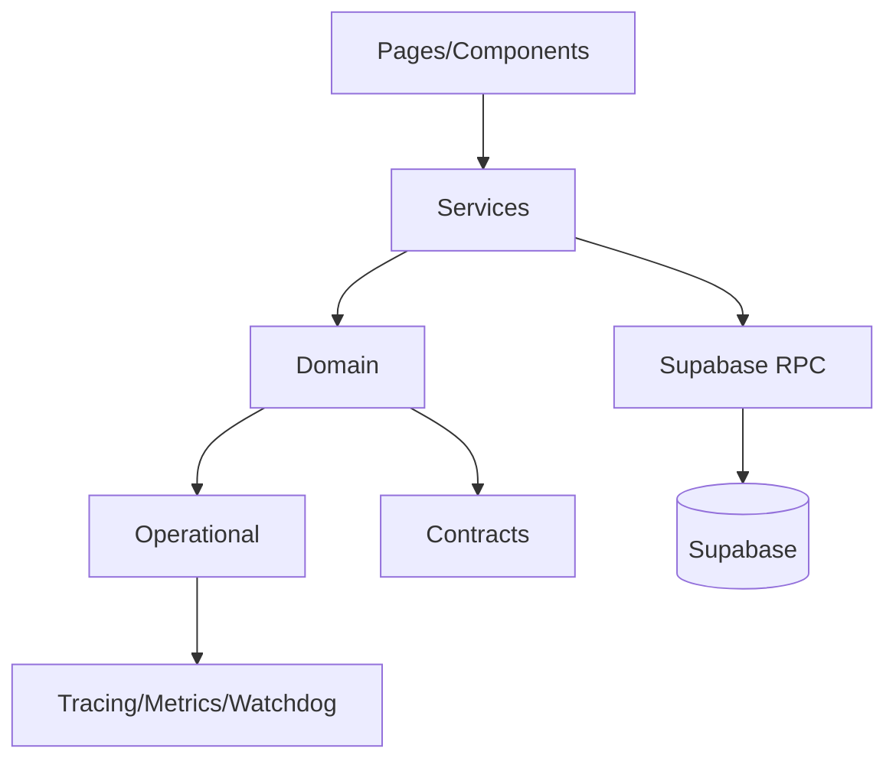

# ARCHITECTURE MAP

> Arquivo gerado automaticamente por `npm run generate:architecture-docs`.

## Contexts

- `GEO`: 0 arquivos
- `REP`: 0 arquivos
- `TIMESHEET`: 0 arquivos
- `OPERATIONAL`: 40 arquivos
- `RELIABILITY`: 0 arquivos
- `AUDIT`: 0 arquivos
- `REPLAY`: 0 arquivos
- `GOVERNANCE`: 0 arquivos
- `OBSERVABILITY`: 0 arquivos

## Contratos

- `contracts/events.contract.ts`
- `contracts/geo.contract.ts`
- `contracts/incidents.contract.ts`
- `contracts/replay.contract.ts`
- `contracts/rpc.contract.ts`
- `contracts/timeline.contract.ts`
- `contracts/trace.contract.ts`

## RPC Map

- `create_tenant_onboarding`
- `insert_punch_evidence_for_own_punch`
- `rep_promote_pending_rep_punch_logs`
- `set_time_record_geo_snapshot_if_absent`
- `timesheet_is_closed_for_stamp`

## Timeline Events / Integração

- `TIMELINE_APPEND`
- `appendTimeAttendanceTimelineEvent`
- `time_attendance_timeline`

## Dependency Graph (high level)

