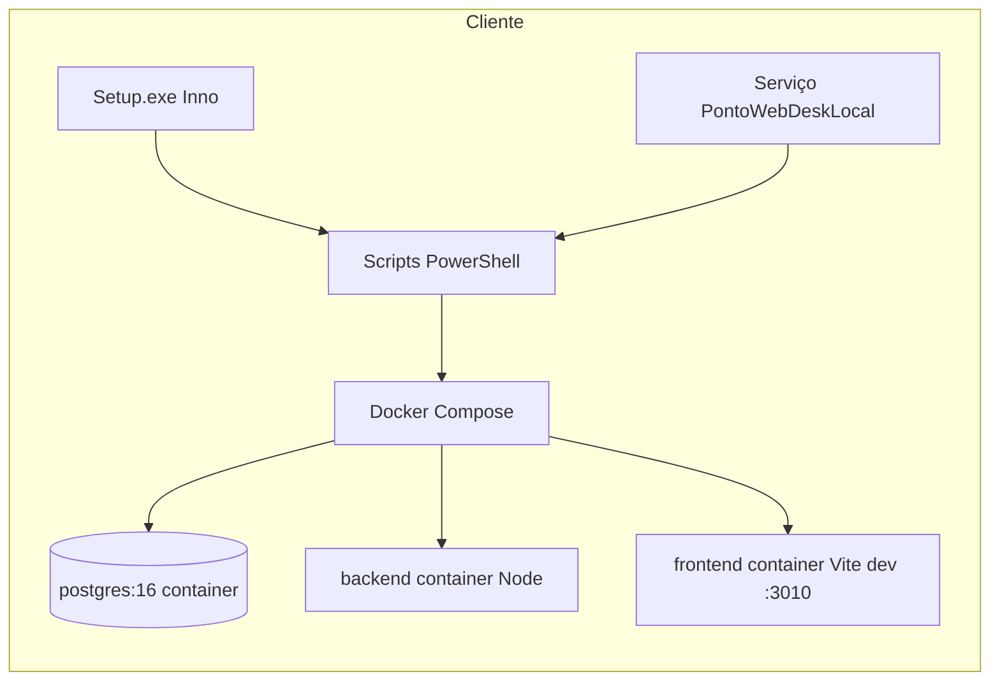
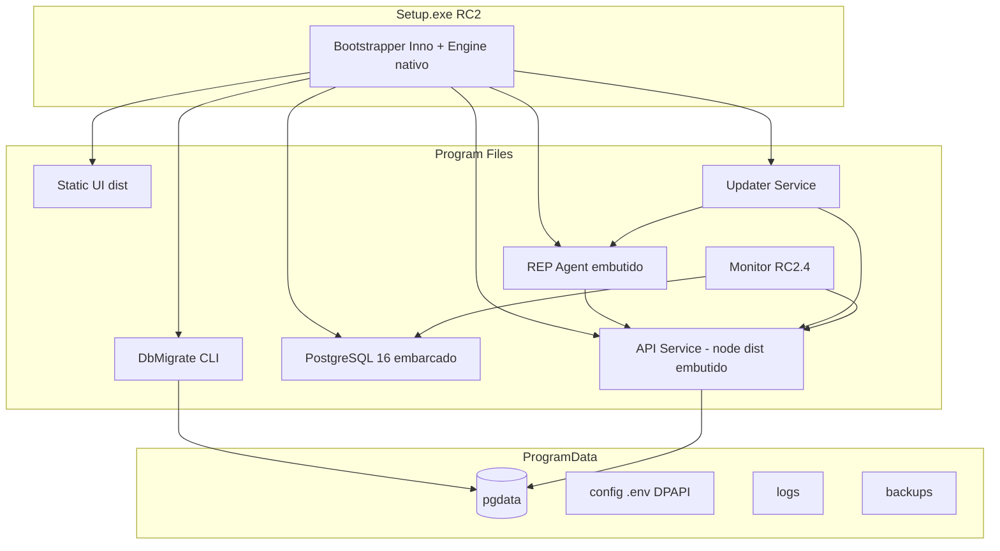
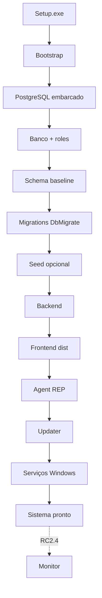
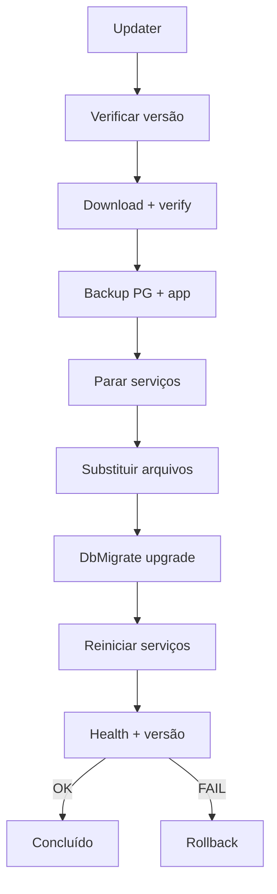

# Arquitetura — Instalador Profissional PontoWebDesk RC2

| Campo | Valor |
|-------|--------|
| **Versão do documento** | **RC2-ARCH-1.0.0** |
| **Status** | **Draft Congelado** |
| **Data de congelamento** | 2026-08-06 |
| **Autor** | Equipe PontoWebDesk (arquitetura instalador RC2) |
| **Objetivo** | Especificação oficial do Instalador Profissional RC2 — runtime Windows nativo, sem Docker, um Setup único |

**Tipo:** Especificação técnica oficial (somente documentação)  
**Escopo:** Instalador profissional RC2  
**Restrição:** Este documento **não** implementa código; descreve auditoria do estado atual (RC1) e arquitetura alvo congelada.  
**Base analisada:** Repositório `PontoWebDesk` (instalador RC1 `1.0.0-rc.1`) + `docs/AUDITORIA_ARQUITETURA_RC2.md`

### Changelog do documento

| Versão | Data | Alteração |
|--------|------|-----------|
| RC2-ARCH-1.0.0 | 2026-08-06 | Congelamento inicial: correção fase **Monitor → RC2.4**; capítulo ADR; matrizes; critérios de congelamento; conclusão executiva |
| (pré-1.0.0) | 2026-08-06 | Rascunho expandido (seções 0–15, build, recuperação, DEV/PROD) |

## Índice rápido (verificação do documento)

| Pergunta / tema | Onde está |
|-----------------|-----------|
| Separação RC1 vs RC2 | **Seção 0** |
| Diagrama fluxo Setup → sistema pronto | **Seções 3.5 e 4** |
| Responsabilidades por componente | **Seção 3.3** |
| Pipeline de build (linha de montagem) | **Arquitetura de Build** |
| DEV vs PRODUÇÃO | **Desenvolvimento vs Produção** |
| Arquitetura de atualização (Updater) | **Seção 8** |
| Estratégia de banco (sem SQL manual) | **Seção 6.0–6.7** |
| Recuperação / rollback comercial | **Arquitetura de Recuperação** + seção 10 |
| ADR, matrizes, congelamento | **Decisões ADR**, **Matriz impacto/dependências**, **Critérios congelamento** |

---

## Auditoria executada (fontes verificadas)

| Área | Caminhos / artefatos inspecionados |
|------|-------------------------------------|
| Instalador | `installer/setup.iss`, `build-installer.bat`, `build-updater.bat`, `install-silent.bat`, `CHECKLIST-INSTALLER.md`, `README-INSTALLER.md`, `scripts/*.ps1`, `rep-agent.iss`, `staging/` |
| Empacotamento | `scripts/_pack_saas_demo.mjs`, `scripts/sync-installer-runtime.mjs`, `scripts/verify-installer-runtime.mjs`, `package.json` (`installer:sync-runtime`, `installer:verify-runtime`) |
| Runtime demo | `SaaS-Demo/`, `PontoWebDesk-Demo/SaaS-Demo/`, `docker-compose.yml` gerado |
| Backend | `backend/package.json`, `backend/scripts/apply-full-database.mjs`, `apply-migrations.mjs`, `backend/db/migrations/`, `backend/src/master/localLicense/` |
| Frontend | Raiz Vite (`package.json`, `vite build`), runtime demo com `frontend/Dockerfile` (`npm run dev`) |
| Shared | `shared/master-contract/` (`dist/index.js`, build TypeScript) |
| Agente | `agent/` (sync relógios / fila offline), `scripts/rep-agent*.mjs`, `installer/rep-agent.iss` |
| Updater | `updater-agent/` (orquestrador, backup, rollback), `installer/build-updater.bat`, `installer/scripts/update-stack.ps1` |
| Homologação RC1 | `docs/HOMOLOGACAO_FINAL_RC1.md`, `docs/RELATORIO_FIX_INSTALLER_COMPOSE.md` |

---

# 0. Separação RC1 e RC2 (leitura obrigatória)

**RC1 e RC2 são produtos de entrega diferentes.** O código da aplicação (backend, frontend, regras de negócio) evolui na mesma base Git; o que muda é **como o cliente instala e opera** o PontoWebDesk Local.

## RC1 — Produto atual (entregue hoje)

| Atributo | RC1 |
|----------|-----|
| **Status** | Consolidado (`1.0.0-rc.1`), instalador `PontoWebDesk-Local-Setup.exe` |
| **Runtime** | **Docker Desktop** + **Docker Compose** + **containers** |
| **PostgreSQL** | Container `postgres:16-alpine` (volume Docker) |
| **Backend** | Container Node (`npm run release` na imagem) |
| **Frontend** | Container **Vite dev** (`npm run dev` :3010) |
| **Orquestração** | PowerShell (`start-stack.ps1`, `ensure-docker.ps1`) |
| **Serviço Windows** | **Um** serviço `PontoWebDeskLocal` → loop Docker |
| **Updater cliente** | ZIP + `update-stack.ps1` (runtime compose; migrate pós-update **não** garantido) |
| **REP** | Instalador **separado** (`rep-agent.iss`), Node no PATH |
| **Público** | Cliente/técnico tolera Docker; homologação completa **pendente/reprovada** em checklist amplo |

```text
RC1  =  Produto atual
         + Docker
         + Compose
         + Containers
         + Scripts visíveis (Iniciar/Parar/Atualizar via PowerShell)
```

**RC1 não é descartado no Git overnight:** permanece até RC2.4 (descontinuação planejada). RC2 **não altera** regras de negócio; substitui **empacotamento e runtime no cliente**.

## RC2 — Novo modelo (especificação deste documento)

| Atributo | RC2 |
|----------|-----|
| **Status** | **Não implementado** — guia oficial de implementação |
| **Runtime** | **Sem Docker**, **sem Compose**, **sem containers** |
| **PostgreSQL** | **Banco local** embarcado, serviço Windows dedicado, dados em ProgramData |
| **Backend** | Binários + Node redistribuível, serviço **PontoWebDeskApi** |
| **Frontend** | **`vite build`** estático (produção), não hot reload |
| **Orquestração** | Bootstrap interno do Setup (invisível ao técnico) |
| **Serviços Windows** | PG, API, Web (opcional), **Agent**, **Updater**; **Monitor** a partir de **RC2.4** (ver ADR-005) |
| **Instalador** | **Instalador profissional único** (Setup.exe) |
| **Updater** | Ciclo completo: versão → backup → migrate → restart → rollback |
| **Público** | Técnico leva **um** instalador; **zero** comando manual |

```text
RC2  =  Novo modelo
         + Sem Docker
         + Sem Compose
         + Windows Services
         + Banco local
         + Instalador profissional
```

## Coexistência e migração

| Período | RC1 | RC2 |
|---------|-----|-----|
| RC2.1–RC2.3 | Mantido (branch/installer congelado) | Desenvolvimento + homologação paralela |
| RC2.4 | Descontinuação anunciada | Produto Local padrão |
| Cliente existente RC1 | Migrador opcional (backup PG + config) | Instalação limpa recomendada |

---

# 1. Situação atual

## 1.1 Visão geral

O produto **PontoWebDesk Local (RC1)** é distribuído como `PontoWebDesk-Local-Setup.exe` (Inno Setup), instalando em `%ProgramFiles%\PontoWebDesk\Local` e dados em `%ProgramData%\PontoWebDesk\Local`. O runtime empacotado é uma cópia do monorepo (backend + frontend + supabase) dentro de `{app}\runtime`, orquestrada por **Docker Compose**.



## 1.2 Docker

- **Compose:** gerado por `scripts/_pack_saas_demo.mjs` → `SaaS-Demo/docker-compose.yml` (espelhado em `PontoWebDesk-Demo/SaaS-Demo` e copiado para `installer/staging/` via `build-installer.bat`).
- **Serviços:** `postgres` (16-alpine), `backend` (build `backend/Dockerfile`, `npm run release`, CMD `node dist/server.js`), `frontend` (build `frontend/Dockerfile`, CMD **`npm run dev`** na porta 3010).
- **Pré-requisito:** Docker Desktop; `installer/scripts/ensure-docker.ps1` detecta engine ou orienta instalação (`prereqs/DockerDesktopInstaller.exe` opcional no pacote).
- **Operação:** `start-stack.ps1` → `docker compose up -d --build`, health API em `http://localhost:3000/health`, restore SQL em `%ProgramData%\...\database\initial.sql`, **`db:migrate:full`** no container backend (marker `.schema_migrated`).

**Pontos fortes:** paridade com RC1; healthchecks postgres/backend; volumes nomeados (`saas_demo_pgdata`).

**Limitações:** dependência Docker Desktop; rebuild de imagem expõe falhas `npm` (ex.: frontend); compose já quebrou por YAML inválido no healthcheck (corrigido no pack — ver `RELATORIO_FIX_INSTALLER_COMPOSE.md`); usuário vê mensagens sobre Docker/reboot.

## 1.3 Backend

- **Código:** `backend/` — Express, Master, operacional, REP API, migrations em `backend/db/migrations/` (até **043** verificadas no verify-runtime).
- **Build produção:** `npm run release` (master-contract + `tsc`); start `node dist/server.js`.
- **Migrations:**  
  - `npm run db:migrate` → `apply-migrations.mjs` (só `backend/db/migrations`).  
  - `npm run db:migrate:full` → `apply-full-database.mjs`: `bootstrap.sql`, `supabase_full_schema.sql`, `supabase/migrations/*.sql`, `backend/db/migrations/*.sql`, ledger `_schema_migrations`.
- **Config:** `.env` / `backend/.env` copiados no pack demo; `DATABASE_URL` aponta para host `postgres` no compose.
- **Licença local:** `backend/src/master/localLicense/LocalLicenseManager.ts` (MachineId, LicenseKey, offline).

**Pontos fortes:** pipeline de schema maduro e idempotente via ledger; Master persistence migrations (018, 027, 036+); contrato `shared/master-contract` compilado.

**Limitações:** no instalador RC1, migrate roda **dentro** do container via exec; falha depende de Docker estar up; credenciais Master demo no `.env` empacotado.

## 1.4 Frontend

- **Desenvolvimento:** Vite na raiz do repo (`npm run build` / `vite build --mode production`).
- **No instalador RC1:** runtime demo usa **Vite dev server** no container (`frontend/Dockerfile`), não o `dist/` de produção.
- **Provider:** `VITE_DATA_PROVIDER=LOCAL_API`, API em `localhost:3000`.

**Pontos fortes:** build production existe no monorepo; módulos Master, operacional, REP, geo, financeiro no mesmo SPA.

**Limitações:** imagem Docker de “produção” ainda é dev server; maior superfície de falha no `docker compose build`.

## 1.5 PostgreSQL

- **RC1 Local:** container PostgreSQL 16; dados no volume Docker (não serviço Windows nativo).
- **Seed:** `install-runtime.ps1` copia `backup_demo.sql` / `initial.sql` para ProgramData; `start-stack.ps1` restaura via `psql` no container **após** migrate (ordem definida em `start-stack.ps1`).
- **Pack:** `_pack_saas_demo.mjs` pode gerar `database/backup_demo.sql` a partir de `backend/.env.development` (pg_dump).

**Pontos fortes:** engine alinhado ao usado em dev (55432 local / 5432 compose).

**Limitações:** backup/restore expõe porta 5432 no firewall; técnico pode interpretar necessidade de “banco Docker”; homologação RC1 reportou gaps Master quando migrate/restore não alinhados.

## 1.6 Agente (dois trilhos distintos — verificado)

| Trilho | Localização | Função | Instalação hoje |
|--------|-------------|--------|-----------------|
| **REP Agent (Windows)** | `scripts/rep-agent.mjs` + dezenas de módulos `rep-agent-*.mjs` | Comunicação com relógios REP, fila, HMAC, serviço Windows | **`installer/rep-agent.iss`** → `C:\PontoWebDeskAgent`, serviço `PontoWebDeskRepAgent`, requer **Node no PATH** (`node.exe`) |
| **Clock sync agent** | `agent/` (TypeScript, adapters Control iD, Henry, Dimep) | Fila offline SQLite → sync API/Supabase | **`npm run clock-sync-agent`** (dev); **não** integrado ao Setup Local RC1 |

**Pontos fortes:** REP agent já tem instalador Inno + NSSM + testes; adapters de hardware em `agent/adapters/`.

**Limitações:** dois produtos/agentes conceituais; REP separado do Setup Local; clock-sync agent fora do `.exe` principal.

## 1.7 Atualizador (dois trilhos distintos — verificado)

| Trilho | Localização | Função |
|--------|-------------|--------|
| **Local ZIP (RC1)** | `build-updater.bat` → `installer/updates/PontoWebDesk-Local-Update-*.zip`; `update-stack.ps1` | Backup pasta `runtime`, expand ZIP, `start-stack.ps1` — **sem** migrate dedicado pós-update |
| **Updater enterprise** | `updater-agent/` (`orchestrator.ts`, `backupManager.ts`, `healthChecker.ts`) | Heartbeat Master → claim → download → verify → backup → install → restart → health → **rollback** |

**Pontos fortes:** `updater-agent` já documenta ciclo completo com rollback; assinatura SHA-256/HMAC.

**Limitações:** **não** ligado ao `setup.iss` RC1; exige Node 18+ no host; `update-stack.ps1` não executa `db:migrate:full` após update; ZIP contém runtime Docker inteiro.

## 1.8 Instalador RC1

- **Entrada:** `installer/build-installer.bat` — robocopy de `PontoWebDesk-Demo/SaaS-Demo` ou fallback `SaaS-Demo` → `staging/` → `ISCC setup.iss`.
- **AppId:** serviço **`PontoWebDeskLocal`** via NSSM → `bin/run-service.cmd` → `service-wrapper.ps1` (loop: `start-stack.ps1` + monitor compose a cada 60s).
- **Atalhos:** PowerShell explícito para Iniciar/Parar/Atualizar.
- **Versão:** `installer/VERSION` (`1.0.0-rc.1`).

**Pontos fortes:** Inno Setup maduro; instalação silenciosa; logs em ProgramData; checklist e go-live scripts (`_golive_*.ps1`); verify-runtime automatizado.

**Limitações:** experiência não “profissional única”; mensagem pós-install cita Docker; homologação final RC1 **reprovada** para checklist completo (máquina limpa, login Master, módulos UI).

## 1.9 Scripts relacionados (mapa)

| Script | Papel |
|--------|--------|
| `_pack_saas_demo.mjs` | Gera `SaaS-Demo`, Dockerfiles, compose, `.env` demo, `initial.sql` |
| `sync-installer-runtime.mjs` | Pack + espelho `PontoWebDesk-Demo/SaaS-Demo` |
| `verify-installer-runtime.mjs` | Arquivos obrigatórios + migrations 041–043, 018, 027 |
| `ensure-docker.ps1` | Engine / install Docker |
| `install-runtime.ps1` | ProgramData, firewall 3010/3000/5432, `run-service.cmd` |
| `start-stack.ps1` | Compose up, migrate full, restore, health |
| `stop-stack.ps1` / `uninstall-stack.ps1` | Parada / remoção compose |
| `update-stack.ps1` | Update ZIP runtime |
| `validate-ports.ps1` | Portas livres |
| `service-wrapper.ps1` | Serviço Windows loop docker |

## 1.10 Resumo: pontos fortes vs limitações globais

| Pontos fortes | Limitações |
|---------------|------------|
| Aplicação RC1 completa empacotável | Docker + compose como runtime |
| `db:migrate:full` implementado e testável | Execução acoplada a container |
| Inno + NSSM + ProgramData | Node visível (REP agent; dev frontend) |
| Updater-agent arquitetado (Master) | Não integrado ao instalador Local |
| verify-runtime e pipeline sync | Update local sem migrate automático |
| Master-contract build no Docker backend | Dois instaladores (Local + REP) |

---

# 2. Objetivos

Evoluir para **um único instalador profissional** que o técnico leva ao cliente, sem:

- comandos manuais (PowerShell, `docker`, `npm`, `psql`);
- Docker Desktop;
- Node.js instalado no SO;
- migrations SQL manuais;
- acesso direto ao banco pelo técnico.

**Experiência alvo:** equivalente perceptiva a Secullum Ponto, Control iD, Dimep — setup assistido ou silencioso, serviços Windows, ícone “PontoWebDesk”, atualização guiada, logs para suporte.

**Objetivos derivados (mensuráveis):**

1. Um `.exe` (ou `.exe` + pacote offline único) instala PG + API + UI + REP + updater.
2. First boot: schema + migrate full + seed opcional sem intervenção.
3. Update: backup + migrate + restart + rollback automático.
4. Homologação repetível em VM limpa (checklist seção 14).
5. Manter **regras de negócio** inalteradas — apenas runtime/empacotamento (RC2).

---

# 3. Arquitetura proposta

## 3.1 Componentes



## 3.2 Dependências

| De | Para | Meio |
|----|------|------|
| API | PostgreSQL | `DATABASE_URL` localhost |
| UI | API | HTTP `127.0.0.1:3000/api` (ou servido pelo API) |
| REP Agent | API | REST + auth REP existente |
| Updater | API, REP, PG | stop/start serviços; `DbMigrate` |
| DbMigrate | PostgreSQL | `pg` driver (mesmo `apply-full-database.mjs` empacotado) |
| Monitor | Serviços | SCM + health URLs |

## 3.3 Responsabilidades (uma responsabilidade por componente)

Cada componente RC2 deve ter **escopo único**. A aplicação web continua no backend/frontend; o instalador só empacota e opera o runtime.

| Componente | Responsabilidade única | O que **não** faz |
|------------|------------------------|-------------------|
| **Setup.exe / Bootstrap** | Orquestrar install/repair/uninstall; precheck Windows; registrar serviços; first-run gate | Lógica de negócio; SQL; servir HTTP |
| **PostgreSQL embarcado** | Persistência relacional; serviço `PontoWebDeskPostgreSQL`; arquivos em ProgramData | API REST; migrations (delega ao DbMigrate) |
| **DbMigrate** | Criar DB/roles; aplicar schema + `db:migrate:full` / incremental; ledger `_schema_migrations` | Autenticação; updates de binários |
| **Backend (API)** | HTTP API; **autenticação** (Master + operacional); regras de negócio; acesso ao banco via pool | Interface gráfica; atualizar versão; falar com relógio REP diretamente |
| **Frontend** | **Interface** SPA (Vite `dist`); chamadas à API | Banco; serviços Windows; migrations |
| **Agent (REP)** | Integração **REP** (relógios, fila, comandos HMAC); heartbeat com API | UI web; schema SQL; update de produto |
| **Updater** | **Atualização** de versão (detectar, baixar, backup, parar serviços, swap, migrate, restart, report) | Login de usuário; operação diária do ponto |
| **Monitor** | **Watchdog** de serviços e health; restart policy; Event Log | Deploy de código; migrations |

### Detalhamento Backend vs Frontend (aplicação)

| Camada | Responsabilidades incluídas |
|--------|----------------------------|
| **Backend** | Rotas `/api/*`, auth JWT/sessão, Master, operacional, financeiro, REP **server-side**, geo APIs, licença local (`LocalLicenseManager`), conexão PostgreSQL |
| **Frontend** | Rotas React, UX Master/Empresa/funcionário, cartão de ponto, telas REP admin, geo no browser, consumo `LOCAL_API` |

### Detalhamento Agent vs Updater vs Monitor

| Camada | Responsabilidades incluídas |
|--------|----------------------------|
| **Agent** | `rep-agent.mjs` (RC2 empacotado): dispositivos, sync, fila offline REP |
| **Updater** | `updater-agent` orchestrator: manifest, assinatura, backupManager, rollback |
| **Monitor** | **RC2.4+:** poll `/api/health/live`, PG, REP; aciona SCM recovery. **RC2.1–RC2.3:** não instalado (ADR-005) |

## 3.4 Comunicação

- Toda comunicação **localhost** por padrão.
- Updater fala com Master Control Plane **opcional** (modo HYBRID) reutilizando API documentada em `updater-agent/README.md`.
- Agente REP **não** usa browser; tokens via config em ProgramData.

## 3.5 Diagrama — fluxo vertical de instalação RC2

Fluxo **canônico** para onboarding de novos desenvolvedores (do Setup ao sistema pronto):

```text
Setup.exe
    ↓
Bootstrap (precheck + permissões)
    ↓
PostgreSQL (install silencioso + serviço)
    ↓
Banco (CREATE DATABASE / roles — automático)
    ↓
Schema (bootstrap + supabase_full_schema)
    ↓
Migrations (db:migrate:full / DbMigrate install)
    ↓
Seed (dados iniciais opcionais)
    ↓
Backend (copiar dist + registrar serviço API)
    ↓
Frontend (copiar www dist)
    ↓
Agent (REP + serviço)
    ↓
Updater (binário + serviço/task)
    ↓
Serviços Windows (dependências + recovery)
    ↓
Sistema pronto (health OK + browser)

(Fora do Setup RC2.1–RC2.3 — entrega RC2.4)
Monitor (watchdog PontoWebDeskMonitor)
```



---

# Desenvolvimento vs Produção

Separação **obrigatória** entre como o time desenvolve e como o cliente opera.

## Ambiente DEV (repositório / máquina do desenvolvedor)

| Aspecto | DEV hoje (verificado) |
|---------|------------------------|
| **Orquestração** | Docker Compose (`SaaS-Demo`, `PontoWebDesk-Demo/SaaS-Demo`) |
| **Frontend** | Vite **hot reload** (`npm run dev`, container `npm run dev` no demo pack) |
| **Backend** | `tsx watch` ou container com rebuild |
| **PostgreSQL** | Container ou `127.0.0.1:55432` (`backend/.env.development`) |
| **Empacotamento** | `_pack_saas_demo.mjs` → pastas demo; **não** é o alvo RC2 cliente |
| **Instalador** | `build-installer.bat` gera RC1 Docker |

```text
DEV  =  Docker + Hot Reload + Compose + SaaS-Demo / scripts locais
```

## Ambiente PRODUÇÃO (cliente final RC2)

| Aspecto | PRODUÇÃO RC2 (alvo) |
|---------|---------------------|
| **Orquestração** | **Serviços Windows** (SCM) |
| **Frontend** | Arquivos estáticos `dist/` |
| **Backend** | `node dist/server.js` (runtime embarcado) |
| **PostgreSQL** | **Banco local** serviço dedicado |
| **Instalador** | **Um** `PontoWebDesk-Setup.exe` profissional |
| **Comandos** | **Nenhum** `docker`, `npm`, `psql` para o técnico |

```text
PRODUÇÃO  =  Sem Docker + Serviços + Banco local + Instalador
```

## Regra de ouro

| | DEV | PRODUÇÃO |
|---|-----|----------|
| Objetivo | Velocidade de desenvolvimento | Confiabilidade e simplicidade |
| Entregável ao cliente | **Não** enviar `SaaS-Demo` / compose | Enviar artefato RC2 build pipeline |
| Paridade | Mesmo backend/frontend **compilado** que entra no Setup | Binários vindos da linha de montagem (seção abaixo) |

---

# Arquitetura de Build

Hoje existe **mistura** de pastas e fluxos (`SaaS-Demo`, `PontoWebDesk-Demo`, `installer/staging`, cópia monorepo, Dockerfiles gerados). No RC2 a **linha de montagem oficial** substitui o pack demo como fonte do instalador cliente.

## Estado atual da build (RC1 — auditado)

```text
Git (monorepo)
    ↓
sync-installer-runtime.mjs
    ↓
_pack_saas_demo.mjs  →  SaaS-Demo + PontoWebDesk-Demo/SaaS-Demo
    ↓
verify-installer-runtime.mjs
    ↓
build-installer.bat (robocopy staging)
    ↓
Inno Setup (setup.iss)
    ↓
PontoWebDesk-Local-Setup.exe   ← RC1 Docker

build-updater.bat  →  ZIP (runtime compose)
rep-agent.iss      →  pontowebdesk-rep-agent-setup.exe (separado)
```

**Problema:** frontend no pacote RC1 é **dev server** no Docker; build production (`vite build`) não é o artefato instalado.

## Linha de montagem alvo (RC2 — oficial)

```text
Git (tag Release RC2.x)
    ↓
Release CI / build host
    ↓
Build shared/master-contract     (npm run build → dist/)
    ↓
Build Backend                    (npm run release → backend/dist + prod node_modules)
    ↓
Build Frontend                   (npm run build → dist/ estático)
    ↓
Build Agent REP                  (bundle rep-agent + deps → Agent/REP)
    ↓
Build Updater                    (updater-agent npm run build → dist/)
    ↓
Build DbMigrate                  (empacotar apply-full-database.mjs + migrations SQL)
    ↓
Empacotar Runtime RC2            (Program Files layout + PG redist + Node redist)
    ↓
verify-installer-runtime RC2     (sem docker-compose.yml obrigatório)
    ↓
Inno Setup (setup-professional.iss)
    ↓
PontoWebDesk-Setup.exe           ← RC2 profissional

Paralelo:
    ↓
Gerar pacote Updater (.pwdupdate / ZIP assinado + manifest)
    ↓
Gerar manifest de versão (VERSION, sha256, migrationRequired)
```

## Detalhe: npm run build → artefatos

| Passo | Comando (monorepo auditado) | Saída empacotada |
|-------|----------------------------|------------------|
| Shared | `npm run build --prefix shared/master-contract` | `Backend/shared/master-contract/dist` |
| Backend | `cd backend && npm run release` | `backend/dist/server.js`, deps produção |
| Frontend | `npm run build` (raiz Vite production) | `dist/` → `Frontend/www` |
| Agent | *(RC2)* bundle de `scripts/rep-agent*.mjs` | `Agent/REP/` |
| Updater | `cd updater-agent && npm run build` | `Updater/PontoWebDesk.Updater.exe` ou `dist/` + node |
| Migrations | Copiar artefatos SQL | `Migrations/` (supabase + backend/db/migrations) |
| Instalador | `ISCC setup-professional.iss` | `PontoWebDesk-Setup.exe` |

## O que permanece só em DEV

- `SaaS-Demo/`, `PontoWebDesk-Demo/` (opcional, compose local)
- `docker-compose.yml` gerado por `_pack_saas_demo.mjs`
- `setup.iss` RC1 / `PontoWebDesk-Local-Setup.exe`

## O que a build RC2 **não** inclui no cliente

- `node_modules` de dev do monorepo inteiro
- Fontes TypeScript não compiladas
- Docker Desktop, compose, Dockerfiles
- Scripts PowerShell expostos em atalhos

---

# 4. Fluxo completo da instalação

```
Verificar Windows (versão, arquitetura, disco, portas)
        ↓
Verificar permissões (Administrador, política execução interna)
        ↓
Instalar PostgreSQL silenciosamente (bin em Program Files, data ProgramData)
        ↓
Iniciar serviço PontoWebDeskPostgreSQL → aguardar ready
        ↓
Criar role aplicativo + role migrate (ou uso temporário elevado só no install)
        ↓
Criar database pontowebdesk + extensions
        ↓
Executar schema baseline (equivalente bootstrap + supabase_full_schema)
        ↓
Executar db:migrate:full (ledger _schema_migrations)
        ↓
Importar dados iniciais (opcional / flag DEMO)
        ↓
Instalar Backend (dist + node redist + master-contract dist)
        ↓
Instalar Frontend compilado (www/dist → Program Files ou ProgramData)
        ↓
Instalar Agente REP (runtime embutido, sem Node no PATH)
        ↓
Instalar Atualizador (bin + serviço Manual/Scheduled)
        ↓
Criar serviços Windows + dependências + recovery policy (PG, API, Web opcional, REP, Updater — **sem Monitor até RC2.4**)
        ↓
Criar atalhos (sem PowerShell visível — launcher .exe ou URL)
        ↓
Iniciar serviços → health gate
        ↓
Abrir sistema (http://localhost:3010 ou URL unificada)
        ↓
First-run web (Master owners / licença local se vazio)
```

Cada etapa grava em `install-state.json` e `logs/install.log` (códigos de erro numerados para suporte).

---

# 5. Estrutura final proposta

Raiz sugerida: **`C:\Program Files\PontoWebDesk\`** (RC2 unifica marca; RC1 usava `\Local` — migrador documentado na RC2.4).

```text
C:\Program Files\PontoWebDesk\
├── VERSION
├── LICENSE.txt
├── Backend\
│   ├── node\                    # runtime Node redistribuível (sem instalador nodejs.org)
│   ├── server\                  # backend/dist + node_modules produção
│   └── shared\master-contract\  # dist
├── Frontend\
│   └── www\                     # vite build (index.html + assets)
├── Database\
│   ├── bin\                     # postgres/pg_ctl (redist)
│   └── tools\                   # pg_dump/pg_restore embutidos
├── Agent\
│   └── REP\                     # rep-agent empacotado
├── Updater\
│   └── PontoWebDesk.Updater.exe
├── Monitor\
│   └── PontoWebDesk.Monitor.exe
├── Migrations\
│   ├── manifest.json            # versão + lista de arquivos empacotados
│   ├── supabase_full_schema.sql
│   ├── supabase\migrations\
│   └── backend\db\migrations\
├── Bin\
│   ├── PontoWebDesk.DbMigrate.exe
│   └── PontoWebDesk.Launcher.exe  # abre browser / tray
└── Uninstall.exe

C:\ProgramData\PontoWebDesk\
├── Config\
│   ├── backend.env
│   ├── agent.env
│   └── secrets.dat              # DPAPI
├── Database\
│   └── pgdata\
├── Logs\
├── Temp\
├── Backups\
│   ├── pg\
│   └── app\
└── Updates\
    ├── cache\
    └── staging\
```

*(RC1 mantém `%ProgramFiles%\PontoWebDesk\Local\runtime` + `%ProgramData%\PontoWebDesk\Local` — RC2 substitui esse layout.)*

---

# 6. Banco de dados

## 6.0 Política — zero SQL manual para técnicos

Em **produção RC2**, o técnico de campo ou TI **nunca** deve ser instruído a executar:

| Proibido para operação normal | Quem executa no RC2 |
|-------------------------------|---------------------|
| `psql` interativo | **DbMigrate** + serviço PostgreSQL (install/update) |
| `CREATE DATABASE` / `CREATE USER` | Bootstrap install (automático) |
| `ALTER TABLE` / migrations avulsas | **DbMigrate upgrade** (ledger `_schema_migrations`) |
| `INSERT` de seed manual | Seed opcional via flag DEMO / first-run UI |
| Restaurar backup “na mão” | **Updater rollback** ou utilitário suporte interno (não documentado ao cliente) |

Tudo ocorre via **Setup.exe**, **Updater** ou **Repair** do instalador. Logs em `%ProgramData%\PontoWebDesk\Logs\migrate-*.log` substituem terminal SQL.

## 6.1 Instalação automática

- PostgreSQL 16 embarcado, serviço **`PontoWebDeskPostgreSQL`**, porta configurável (default 5432 ou 55432 se conflito detectado no precheck).

## 6.2 Criação automática

- Database `pontowebdesk`, roles `pontoweb_app` / `pontoweb_migrate`, extensions conforme `apply-full-database.mjs`.

## 6.3 Migrations automáticas

- **First install:** invocar lógica idêntica a `backend/scripts/apply-full-database.mjs` (`STEPS`: bootstrap, supabase_full_schema, supabase migrations, backend migrations).
- **Upgrade:** mesma ferramenta, só pendentes via `_schema_migrations`.
- **Implementação RC2:** empacotar script atual como módulo do `PontoWebDesk.DbMigrate.exe` (Node SEA ou `node.exe` oculto em `Bin\`) — **sem alterar regras SQL**, apenas invocação.

## 6.4 Atualização automática

- Updater para API/Agent → executa `DbMigrate upgrade` antes de subir serviços.

## 6.5 Backup

- **Install/Update:** `pg_dump -Fc` para `ProgramData\Backups\pg\`.
- **App:** cópia versionada de `Backend`, `Frontend`, `Agent`.

## 6.6 Restore

- Utilitário interno (menu suporte avançado **oculto**, não para técnico de campo) ou Updater rollback.

## 6.7 Rollback

- Restaurar dump + binários `last-good` (ver seção 10).

**Regra:** nenhum técnico executa SQL manualmente em operação normal.

---

# 7. Serviços Windows

| Serviço | Binário | Start | Dependências |
|---------|---------|-------|--------------|
| **PontoWebDeskPostgreSQL** | `pg_ctl` / serviço PG | Automatic (Delayed) | — |
| **PontoWebDeskApi** | `node dist/server.js` | Automatic | PostgreSQL |
| **PontoWebDeskWeb** | opcional se UI separada | Automatic | API |
| **PontoWebDeskRepAgent** | rep runtime | Automatic | API |
| **PontoWebDeskUpdater** | updater-agent | Manual / Task Scheduler | — |
| **PontoWebDeskMonitor** | monitor | Automatic | API, PostgreSQL |
| *(RC2.4)* | **Monitor não é instalado nem registrado em RC2.1–RC2.3.** Até lá, recuperação runtime usa **SCM recovery** (serviços PG/API/REP). Monitor entra no Setup/atualizador a partir de **RC2.4** (ADR-005). |

## 7.1 Recuperação e restart

- Failure actions: restart 5s / 30s / 60s (API, PG, REP).
- **RC2.1–RC2.3:** SCM recovery nos serviços críticos; health gate no Bootstrap/Updater.
- **RC2.4+ (Monitor):** se `/api/health/live` falhar N vezes, Monitor aciona restart API (complementa SCM); log `Monitor.log` + Event Log (ADR-003).

## 7.2 Logs

- Redirecionar stdout/stderr por serviço em `%ProgramData%\PontoWebDesk\Logs\`.
- Rotação por tamanho (política NSSM ou equivalente nativo).

**RC1 hoje:** apenas **`PontoWebDeskLocal`** (wrapper docker loop) — RC2 substitui por serviços por componente.

---

# 8. Atualizações — Arquitetura do Updater

O **Updater** é componente dedicado (responsabilidade única: ciclo de versão). Fundamenta-se em `updater-agent/src/orchestrator.ts` (já implementado no repo) integrado ao Setup RC2.

## 8.1 Fluxo completo (canônico)

```text
Updater
    ↓
Verifica versão (local VERSION vs manifest remoto / ZIP cache)
    ↓
Download (HTTPS / UNC) + validação hash/assinatura
    ↓
Backup (pg_dump + cópia Backend/Frontend/Agent)
    ↓
Parar serviços (REP → API → Web; PG pode permanecer)
    ↓
Substituir arquivos (staging → swap atômico)
    ↓
Rodar migrations (DbMigrate upgrade)
    ↓
Iniciar serviços (PG → API → Web → REP)
    ↓
Validar (/api/health/ready + VERSION)
    ↓
Rollback se necessário (ver Arquitetura de Recuperação)
```



## 8.2 Modos de operação

| Modo | Descrição |
|------|-----------|
| **Local offline** | Pacote `.pwdupdate` / ZIP em `ProgramData\Updates\cache` (evolução do `build-updater.bat`, sem compose) |
| **Hybrid** | Heartbeat Master Control Plane (`updater-agent/README.md`) |
| **Agendado** | Task Scheduler + serviço `PontoWebDeskUpdater` |

## 8.3 RC1 vs RC2 (gap verificado)

| | RC1 `update-stack.ps1` | RC2 Updater |
|---|------------------------|-------------|
| Backup runtime compose | Sim | Backup app + **pg_dump** |
| Migrate pós-update | **Não** | **Obrigatório** |
| Rollback automático | Não | Sim (`orchestrator`) |
| Assinatura artefato | Não | Sim |

**RC1 gap verificado:** `update-stack.ps1` **não** chama migrate após copiar runtime — RC2 corrige no instalador, não no backend.

---

# 9. Segurança

| Ativo | Medida RC2 |
|-------|------------|
| `.env` / `backend.env` | Só ProgramData; ACL SYSTEM + Administrators + conta serviço |
| Credenciais Master | First-run UI ou DPAPI `secrets.dat`; não plaintext em logs |
| Tokens REP / Updater | `updater-agent` pattern (hash no Master; token local protegido) |
| Licença | Reutilizar `LocalLicenseManager` + arquivo assinado |
| Serviços | Virtual accounts; sem Interactive |
| Criptografia | DPAPI para segredos locais; TLS para update remoto |
| Logs | Redação existente (`backend/src/logger/logger.redaction.ts`) aplicada nos arquivos de serviço |

Firewall: regras nomeadas; PostgreSQL não exposto externamente por default.

---

# 10. Estratégia de rollback (resumo)

Resumo executivo; fluxo operacional detalhado na **Arquitetura de Recuperação** (seção seguinte).

1. **Detectar falha** pós-update: migrate exit ≠ 0, health fail, assinatura inválida (abort antes de swap).
2. **Parar** serviços aplicacionais.
3. **Restaurar binários** de `Backups\app\pre-<version>-<ts>` ou `rollback\last-good`.
4. **Restaurar banco** via `pg_restore` do dump pareado (mesmo timestamp).
5. **Reverter** `VERSION` e `install-state.json`.
6. **Subir** serviços; registrar `RollbackCompleted`.
7. **Notificar** admin (Event Viewer; opcional e-mail via integração futura).

Limite: migrations destrutivas exigem dump lógico — backup **obrigatório** antes de cada update.

---

# Arquitetura de Recuperação

Diferencia **instalador comercial** de script ad hoc: toda falha grave tem caminho automático documentado, com **logs** auditáveis.

## Cenários cobertos

| Cenário | Gatilho | Responsável |
|---------|---------|-------------|
| Falha durante **instalação** first-run | DbMigrate fail; PG não sobe; health timeout | Bootstrap → rollback install parcial |
| Falha durante **atualização** | Migrate fail; health pós-update fail | Updater → rollback |
| Falha **runtime** (serviço cai) | API/PG/REP down | **RC2.1–RC2.3:** SCM recovery; **RC2.4+:** Monitor + SCM |
| Corrupção detectada | Health N falhas consecutivas | **RC2.4+:** Monitor restart; escalação suporte |

## Fluxo — falha de instalação

```text
Falha de instalação (etapa X)
    ↓
Abortar sequência (fail-closed)
    ↓
Rollback install parcial
    ↓
Remover serviços registrados (se any)
    ↓
Restaurar snapshot pré-install (se existir) ou limpar ProgramData parcial
    ↓
Logs (install.log + código erro EXxxx)
    ↓
Setup exit code ≠ 0 (silencioso / assistido)
```

O técnico **não** corrige manualmente; reexecuta Setup (repair) ou aciona suporte com log.

## Fluxo — falha de atualização (rollback)

```text
Falha de atualização
    ↓
Rollback (Updater orchestrator)
    ↓
Restaurar banco (pg_restore dump pareado)
    ↓
Restaurar versão anterior (binários last-good)
    ↓
Reiniciar serviços (ordem PG → API → REP)
    ↓
Validar health
    ↓
Logs (updater.log + rollback.log + Event Log)
    ↓
Report failed / RollbackCompleted ao Control Plane (se hybrid)
```

## Fluxo — falha runtime (Monitor — **RC2.4+**)

```text
Monitor detecta health fail
    ↓
Restart serviço (política SCM)
    ↓
Se persistir: Event Log crítico
    ↓
(Opcional) Notificação admin
    ↓
Logs (monitor.log)
```

## Artefatos de recuperação

| Artefato | Local | Uso |
|----------|-------|-----|
| `pg_dump` pré-update | `ProgramData\Backups\pg\` | Restore banco |
| Cópia app pré-update | `ProgramData\Backups\app\` | Restore binários |
| `rollback\last-good\` | ProgramData | Ponteiro versão estável |
| `install-state.json` | ProgramData | Etapa corrente / versão schema |

## O que o técnico **não** faz na recuperação

- Não escolhe dump manualmente em produção normal.
- Não executa `pg_restore` na linha de comando (Updater/Repair interno).
- Não reinstala Docker (RC2).

Suporte N2 pode ter ferramentas internas; documentação **cliente** cita apenas “Restaurar backup automático” ou “Reinstalar com preservar dados”.

---

# 11. Comparação — Arquitetura atual vs RC2

**Referência rápida:** seção **0** (separação RC1/RC2).

| Dimensão | RC1 (atual) | RC2 (alvo) |
|----------|-------------------------|---------------------------|
| Runtime app | Docker Compose 3 containers | Serviços Windows nativos |
| PostgreSQL | Container volume | Serviço dedicado embarcado, pgdata ProgramData |
| Backend | Imagem Docker `npm run release` | `dist/server.js` + Node embarcado |
| Frontend | Vite **dev** no container :3010 | `vite build` estático |
| Node no cliente | Indireto (Docker); REP exige Node PATH | Embutido; PATH limpo |
| Docker | Obrigatório | **Ausente** |
| Instalador | 1 Setup Local (+ REP separado) | **1 Setup único** |
| Serviços | `PontoWebDeskLocal` → scripts docker | PG, API, Web, REP, Updater; **Monitor (RC2.4)** |
| Migrate install | `docker compose exec … db:migrate:full` | `DbMigrate install` local |
| Migrate update | Não no `update-stack.ps1` | Obrigatório no Updater |
| Updater | ZIP + PowerShell | `updater-agent` + pacotes assinados |
| Atalhos | PowerShell visível | Launcher .exe / URL |
| Logs | ProgramData (OK) | ProgramData estruturado por serviço |
| Licença | LocalLicenseManager no backend | Mesmo backend; config segura |
| Build cliente | `_pack_saas_demo` + compose | **Linha de montagem** (Arquitetura de Build) |
| DEV vs PROD | Demo = compose dev frontend | DEV compose; PROD serviços |
| Recuperação | Logs + manual docker | **Arquitetura de Recuperação** automática |
| Homologação | Reprovada checklist completo | Checklist seção 14 |

---

# 12. Roadmap

| Fase | Entrega | Prioridade |
|------|---------|------------|
| **RC2.1** | PostgreSQL embarcado + DbMigrate wrapper + API serviço + frontend **production** estático; Inno `setup-professional.iss`; coexistente com RC1 | **P0** |
| **RC2.2** | Integrar REP (`rep-agent.mjs` empacotado) no setup único; remover Node PATH; seed/first-run Master | **P0** |
| **RC2.3** | Updater integrado (local ZIP/manifest); migrate pós-update; backup pg_dump; **rollback automático** (orchestrator) | **P1** |
| **RC2.4** | **Monitor** (serviço watchdog); descontinuar RC1 Docker; migrador RC1→RC2 | **P1** |
| **RC2.5** | Control Plane updates (heartbeat Master); MSI/Intune; hardening DPAPI | **P2** |

Ordem interna RC2.1: precheck → PG → migrate → API → static UI → serviços → smoke VM.

---

# 13. Impacto (análise — nada modificado)

## 13.1 Arquivos / pastas afetados na implementação futura

| Caminho | Impacto previsto |
|---------|------------------|
| `installer/setup.iss` | Novo ou substituído por `setup-professional.iss`; RC1 congelado |
| `installer/scripts/*.ps1` | Reescrita ou substituição por engine nativa; docker scripts **deprecated** |
| `installer/build-installer.bat` | Novo pipeline artefatos (dist, pg redist, node redist) |
| `installer/build-updater.bat` | Alinhar pacote RC2 (sem compose) |
| `installer/rep-agent.iss` | Absorvido pelo setup único |
| `scripts/_pack_saas_demo.mjs` | Substituído por `_pack_professional_runtime.mjs` ou similar |
| `scripts/sync-installer-runtime.mjs` | Adaptar destinos RC2 |
| `scripts/verify-installer-runtime.mjs` | Novos REQUISitos (sem docker-compose) |
| `SaaS-Demo/` / `PontoWebDesk-Demo/` | Podem permanecer para dev; não entregues ao cliente RC2 |
| `updater-agent/` | Integração binária / serviço |
| `agent/` | Decisão: integrar clock-sync vs manter só REP no RC2.2 |

## 13.2 Componentes afetados

- Empacotamento (principal).
- DevOps release (build host).
- Documentação cliente / suporte.

## 13.3 Componentes que permanecem (reaproveitados)

| Componente | Uso RC2 |
|------------|---------|
| `backend/` (código + dist build) | Inalterado; empacotado |
| `apply-full-database.mjs` / `apply-migrations.mjs` | Invocados por DbMigrate |
| `backend/db/migrations/*`, `supabase/*` | Empacotados em `Migrations/` |
| `shared/master-contract` | Build dist antes do pack |
| Frontend `vite build` output | `Frontend/www` |
| `updater-agent` orchestrator | Base do serviço Updater |
| `scripts/rep-agent*.mjs` | Base do Agent REP |
| Inno Setup + NSSM (ou sc.exe) | Bootstrap |
| `LocalLicenseManager` | Licenciamento offline |

## 13.4 Remover / substituir (cliente final)

| Remover / deprecar | Substituir por |
|--------------------|----------------|
| Docker Desktop dependency | PG embarcado |
| `docker-compose.yml` no cliente | Serviços SCM |
| `start-stack.ps1` / `ensure-docker.ps1` | Install engine RC2 |
| Frontend container Vite dev | Static dist |
| Atalhos PowerShell | Launcher |
| Dois instaladores Local + REP | Setup único |
| `update-stack.ps1` sem migrate | Updater RC2 |

---

# 14. Checklist de homologação — Instalador Profissional RC2

### Instalação

- [ ] VM Windows limpa x64, sem Node/Git/Docker pré-instalados
- [ ] Setup assistido e `/VERYSILENT` exit 0
- [ ] Textos sem Docker/Node/npm
- [ ] Estrutura Program Files / ProgramData conforme seção 5

### Banco

- [ ] Serviço PostgreSQL sobe após install e reboot
- [ ] `DbMigrate install` idempotente; `_schema_migrations` completo
- [ ] Master tables (`master_tenants`, `master_users`) presentes
- [ ] Seed demo opcional funcional

### Serviços

- [ ] API, REP, PG Automatic; recovery policy testada
- [ ] Logs por serviço em ProgramData

### Login / módulos

- [ ] Login Master (owners demo ou first-run)
- [ ] Login Empresa operacional
- [ ] Dashboard, Funcionários, Empresa, Financeiro, Master, REP, Cartão de ponto, Geolocalização, Logs — smoke PASS

### REP

- [ ] Agente serviço conecta API; comando diagnóstico OK

### Atualização

- [ ] Update N→N+1 aplica backup + migrate + restart
- [ ] Versão exibida correta pós-update

### Rollback

- [ ] Falha simulada em migrate restaura binários + banco
- [ ] Sistema operacional após rollback

### Backup

- [ ] pg_dump gerado antes de update; restauração testada em lab

### Reboot

- [ ] Reinício Windows; todos serviços sobem; app acessível ≤ 5 min

### Atualizador

- [ ] Detecção versão; pacote adulterado rejeitado
- [ ] Modo offline (ZIP local) funcional

### Monitor (RC2.4)

- [ ] Serviço `PontoWebDeskMonitor` instalado; watchdog complementa SCM

### Desinstalação

- [ ] Remove serviços e atalhos; opção manter/remover pgdata

---

# 15. Conclusão

## 15.1 O que já está pronto hoje

- **Aplicação RC1** completa (backend Master + operacional, frontend SPA, migrations até 043, master-contract).
- **Pipeline migrate full** (`apply-full-database.mjs`) pronto para ser chamado por wrapper nativo.
- **Instalador Inno RC1** funcional para cenários com Docker (setup, NSSM, ProgramData, logs, update ZIP, desinstalação).
- **Empacotamento demo** (`_pack_saas_demo.mjs`, sync, verify-runtime).
- **Updater-agent** com orchestrator, backup, health, rollback (código separado, testes).
- **REP Agent** instalável via `rep-agent.iss` + serviço Windows.
- **Licenciamento local** no backend (`LocalLicenseManager`).
- **Build production** backend (`npm run release`) e frontend (`vite build`) no monorepo.
- **Correção compose YAML** documentada (`RELATORIO_FIX_INSTALLER_COMPOSE.md`).

## 15.2 O que falta

- Runtime **sem Docker** (PG embarcado + serviços por componente).
- Frontend **production** no pacote cliente (não Vite dev).
- **Setup único** incluindo REP e Updater.
- **DbMigrate** executável oculto no install/update.
- **Update** com migrate obrigatório e rollback automático integrado ao Local.
- **Monitor (RC2.4)** e first-run Master web.
- Homologação completa aprovada (checklist seção 14).
- Migrador RC1 → RC2 e descontinuação RC1.

## 15.3 Maturidade estimada do instalador

| Linha | Maturidade |
|-------|------------|
| Instalador RC1 (Docker) | **~55%** — empacota e instala em ambiente favorável; homologação end-to-end não aprovada |
| Updater-agent (código) | **~70%** — ciclo completo especificado e implementado; não acoplado ao Setup Local |
| REP instalador separado | **~60%** — funcional; depende Node PATH |
| **Instalador Profissional RC2 (alvo)** | **~25%** — arquitetura e peças existem; integração e runtime nativo não implementados |

## 15.4 Riscos técnicos

| Risco | Mitigação |
|-------|-----------|
| Tamanho do instalador (PG + Node + app) | Compressão; download incremental updater |
| Conflito com PostgreSQL corporativo | Porta dedicada + detecção precheck |
| Migrate falha em update | Backup pg_dump obrigatório + rollback |
| Dois agentes (`agent/` vs rep-agent) | Escopo claro RC2.2 (REP primeiro) |
| EPERM/sync em dev (pastas demo lockadas) | Parar serviços antes de pack (operacional build) |
| Assinatura Authenticode / antivírus | Certificado de code signing |

## 15.5 Ordem recomendada de implementação

1. **DbMigrate wrapper + PG embarcado + API serviço + UI estática** (RC2.1) — provar VM limpa sem Docker.  
2. **REP no setup único** (RC2.2).  
3. **Updater com migrate + backup** (RC2.3).  
4. **Monitor + deprecar RC1 + migrador** (RC2.4).  
5. Integração Control Plane e MSI (RC2.5).

---

# Decisões Arquiteturais Pendentes (ADR)

Decisões abertas **não alteram RC2-ARCH-1.0.0** até aprovação formal (ver **Critérios de congelamento**). Cada ADR aprovada gera **RC2-ARCH-1.x.x** patch ou minor conforme impacto.

| Código | Descrição | Opções | Decisão atual (baseline congelada) | Impacto | Fase prevista |
|--------|-----------|--------|-----------------------------------|---------|---------------|
| **ADR-001** | Entrega do **Frontend** | **A)** Static servido pelo Backend (porta única 3000). **B)** Static + serviço **PontoWebDeskWeb** (:3010). **C)** Static em ProgramData + launcher URL fixa | **Pendente** — doc assume **B ou A** até ADR; homologação deve fixar uma | Installer layout, firewall, atalhos, build | **RC2.1** (decisão obrigatória antes de homologar RC2.1) |
| **ADR-002** | **`agent/`** (clock-sync TS) vs **REP Agent** (`rep-agent.mjs`) | **A)** Só REP no Setup RC2. **B)** Dois serviços (REP + ClockSync). **C)** Fusão futura | **A)** REP only no instalador; `agent/` permanece dev/opcional | Agent/, installer, serviços | **RC2.2** (escopo REP); **pós-RC2.4** se **B/C** |
| **ADR-003** | **Health endpoints** oficiais | `/health` vs `/api/health/live` vs `/api/health/ready` | **Pendente** — proposta: **live** = Monitor/SCM; **ready** = Updater pós-update; documentar no código installer | Monitor, Updater, Bootstrap | **RC2.1** (Bootstrap/API); **RC2.3** (Updater) |
| **ADR-004** | **Formato pacote atualização** | **A)** ZIP (evolução RC1). **B)** `.pwdupdate` (layout assinado). **C)** Ambos | **Pendente** — manifest assinado + SHA-256 **obrigatório**; extensão/container TBD | Updater, build-updater, Master hybrid | **RC2.3** |
| **ADR-005** | **Serviço Monitor** | **A)** RC2.4 único (congelado). **B)** Monitor desde RC2.1 | **A) RC2.4** — fase oficial única; RC2.1–RC2.3 usam SCM recovery | Setup, roadmap, homologação | **RC2.4** |
| **ADR-006** | **Migração RC1 → RC2** | **A)** Instalação limpa + import manual suporte. **B)** Migrador automático (dump volume Docker → pgdata nativo). **C)** Side-by-side temporário | **Pendente** — **B** desejável; **A** fallback | Installer, DbMigrate, docs cliente | **RC2.4** |
| **ADR-007** | **Coexistência RC1 + RC2** na mesma máquina | **A)** Proibido (precheck bloqueia). **B)** Permitido portas distintas | **Pendente** — recomendação **A** para produção | Precheck, suporte | **RC2.1** |
| **ADR-008** | **`verify-installer-runtime` RC2** | Lista REQUIRED sem `docker-compose.yml`; incluir PG redist, DbMigrate, Migrations/, dist backend/frontend | **Pendente** — especificar script `verify-installer-runtime-rc2.mjs` na implementação | CI release, build host | **RC2.1** |

---

# Matriz de impacto (implementação RC2)

Estimativa para planejamento (**não** altera código de aplicação). Escala esforço: **S** (≤1 sprint), **M**, **L**.

| Alteração | Backend | Frontend | Banco | Installer | Updater | Agent | Monitor | Risco | Impacto | Esforço |
|-----------|---------|----------|-------|-----------|---------|-------|---------|-------|---------|---------|
| PG embarcado + serviço | — | — | **Alto** | **Alto** | Médio | — | — | Médio | Runtime cliente | **L** |
| DbMigrate wrapper | Baixo (invocação) | — | **Alto** | **Alto** | Alto | — | — | Alto | Schema/Master | **M** |
| API como serviço Windows | Baixo (deploy) | — | Baixo | **Alto** | Médio | Médio | — | Médio | Disponibilidade | **M** |
| Frontend static (ADR-001) | Baixo/Médio | **Alto** (build) | — | **Alto** | Médio | — | — | Médio | UX/URLs | **M** |
| Setup único + REP (ADR-002) | — | — | — | **Alto** | — | **Alto** | — | Médio | Dois .exe → um | **M** |
| Updater + migrate + rollback | — | — | Médio | Médio | **Alto** | Baixo | — | Alto | Updates campo | **L** |
| Monitor RC2.4 (ADR-005) | — | — | — | Médio | Baixo | Baixo | **Alto** | Baixo | Watchdog | **S** |
| Descontinuar RC1 Docker | — | — | — | Médio | Baixo | — | — | Baixo | Suporte | **S** |
| Migrador RC1→RC2 (ADR-006) | — | — | **Alto** | **Alto** | — | — | — | Alto | Clientes existentes | **L** |

---

# Matriz de dependências (obrigatórias)

Ordem de **dependência de runtime** (não necessariamente ordem única de instalação do Setup — ver seção 4). Setas = “depende de / requer disponível”.

```text
Bootstrap (Setup.exe)
    ↓
PostgreSQL (serviço + pgdata)
    ↓
DbMigrate (schema + migrations + roles/database)
    ↓
API (Backend dist — requer DATABASE_URL + PG up)
    ↓
Frontend (requer API — ADR-001 define hosting)
    ↓
Agent REP (requer API — RC2.2+)
    ↓
Updater (opera sobre API/Agent/binários; requer PG para migrate em update)
    ↓
Monitor (RC2.4 — requer API + PG healthy; ADR-005)
```

| Dependente | Depende de | Obrigatório? |
|------------|------------|--------------|
| Bootstrap | — | — |
| PostgreSQL | Bootstrap | Sim |
| DbMigrate | PostgreSQL ready | Sim (install/upgrade) |
| API | PostgreSQL + schema mínimo | Sim |
| Frontend | API | Sim |
| Agent REP | API | Sim (se componente instalado) |
| Updater | API parável; PG para migrate | Sim (componente instalado) |
| Monitor | API + PG | Sim **apenas RC2.4+** |

**Paralelo permitido na build:** shared/master-contract → Backend build → Frontend build → Agent bundle → Updater build → empacotamento.

---

# Critérios de congelamento (RC2-ARCH-1.0.0)

A partir de **RC2-ARCH-1.0.0**:

1. **Nenhuma mudança estrutural** (novos componentes, remoção de componentes, ordem de dependências, layout Program Files/ProgramData) sem **nova versão** do documento e **ADR aprovada**.
2. **Somente ADR aprovada** pode alterar decisões marcadas como pendentes na tabela ADR; aprovação registra: data, responsável, versão alvo (ex.: RC2-ARCH-1.1.0).
3. **Implementação de código** (backend, frontend, installer, scripts) segue o documento congelado; desvios exigem ADR + bump de versão arquitetural.
4. **Patches editoriais** (typo, clareza, links) permitem RC2-ARCH-1.0.x **sem** ADR se não mudarem semântica.
5. **RC1** permanece governado pelo instalador RC1; não é escopo de alteração deste congelamento.

---

# Arquivos que NÃO serão alterados durante este congelamento

Esta atividade (**RC2-ARCH-1.0.0**) altera **somente documentação** (`docs/ARQUITETURA_INSTALADOR_PROFISSIONAL_RC2.md` e relatórios correlatos). **Não** faz parte do congelamento modificar:

| Caminho | Motivo |
|---------|--------|
| `backend/` | Regras de negócio e API permanecem; RC2 muda deploy |
| `frontend/` | SPA inalterada na arquitetura RC2 |
| `installer/` | RC1 congelado até implementação RC2.x |
| `scripts/` | Pipelines atuais (pack demo, rep-agent, etc.) |
| `shared/` | master-contract — build existente reutilizado |
| `agent/` | Escopo ADR-002; não bloqueia doc |
| `updater-agent/` | Base do Updater; integração na fase RC2.3 |

Implementação futura **criará** novos artefatos (ex.: `setup-professional.iss`, `verify-installer-runtime-rc2.mjs`) conforme ADRs aprovadas, sem reescrever RC1 sem plano RC2.4.

---

# Conclusão executiva

| Tópico | Avaliação |
|--------|-----------|
| **Maturidade da arquitetura (documento)** | **~90%** — RC2-ARCH-1.0.0 congelado; ADRs registram lacunas restantes |
| **Maturidade do produto RC2 (implementação)** | **~25%** — peças isoladas (Updater-agent, migrate full, Inno RC1); runtime profissional não integrado |
| **Pendências restantes** | Aprovar ADRs **001, 003, 004, 006, 007, 008**; implementar RC2.1→RC2.4 conforme roadmap |
| **Quando iniciar implementação** | **Imediato após** aceite formal de **RC2-ARCH-1.0.0** e fechamento de **ADR-001** e **ADR-003** (mínimo para RC2.1); demais ADRs conforme fase |

**Mensagem para gestão:** A arquitetura RC2 está **congelada** como referência única; o risco principal não é desenho, e sim **execução disciplinada** da linha de montagem e homologação em VM limpa sem Docker.

---

*Documento **RC2-ARCH-1.0.0** — congelamento arquitetural. Alterações estruturais somente via ADR aprovada. Nenhum código de aplicação alterado por este congelamento.*
