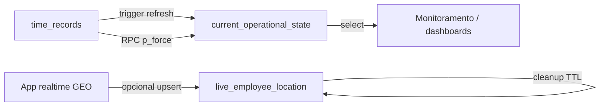

# Hard lock: `current_operational_state` e presença operacional

## Arquitetura final

- **`time_records`**: fonte de verdade **jurídica e de batida** (cadeia, integridade, espelho REP).
- **`current_operational_state` (COS)**: **snapshot derivado** por colaborador (`company_id`, `employee_id`), atualizado na batida (trigger), replay/recovery (RPC com `p_force`) e reconciliação. Campos de controle:
  - `state_version` (monotônico por linha a cada refresh **aceito**)
  - `last_event_sequence`
  - `state_source` (CHECK: `realtime` | `time_record_insert` | `rep_import` | `replay` | `reconciliation` | `manual_adjustment` | `migration` | `recovery`)
  - `last_event_at` (instante do último evento **aceito**; base anti-stale)
- **`live_employee_location`**: posição **efémera** (TTL ~45s na aplicação; coluna `expires_at` + função `cleanup_expired_live_employee_locations`). Uso: **mapa realtime / presença** — não usar para fechamento, folha ou evidência jurídica.

Fluxo resumido:

## Origem da verdade

| Dado | Fonte |
|------|--------|
| Batidas, sequência, hash | `time_records` |
| Status operacional exibido (WORKING/BREAK/…) | COS, recalculado a partir da última batida válida no refresh |
| GEO no mapa a partir de batida | COS (`map_*`, regras PL/pgSQL alinhadas ao hard lock GEO) |
| GEO “ao vivo” sem nova batida | `live_employee_location` + `geoConfidence` / movimento impossível |

## Consistência e anti-stale

Função `refresh_current_operational_state(p_company_id, p_employee_id, p_source, p_event_at, p_force, p_correlation_id)`:

- Se **não** `p_force` e `p_event_at < last_event_at` da linha atual → **não atualiza** o snapshot.
- Log PostgreSQL: `[CURRENT STATE STALE UPDATE BLOCKED]` (payload com ids, instantes, fonte, `state_version`).
- Cada refresh aceito incrementa `state_version` e `last_event_sequence` (no conflito UPSERT).

Realtime atrasado **não pode** reaplicar estado “mais novo” com evento mais antigo: o refresh inteiro é ignorado, evitando regressão visual/operacional.

## Performance do trigger

- Índices em `time_records`: `(company_id, user_id, created_at DESC)`, `(company_id, user_id, timestamp DESC NULLS LAST)`, `(company_id, user_id, type)`, e expressão `(company_id, user_id, (COALESCE(timestamp, created_at)) DESC NULLS LAST)` para a query principal `ORDER BY COALESCE(...) DESC LIMIT 1`.
- Log: `[CURRENT STATE REFRESH PERFORMANCE]` com `execution_ms`, `rows_scanned`, `company_id`, `employee_id`, `correlation_id`, `state_version`, `source`.

**Validação**: em staging, rodar `EXPLAIN (ANALYZE, BUFFERS)` na query documentada no fim da migração `20260510120000_operational_state_hardlock_final.sql`.

## Reconciliação (TypeScript)

Arquivo: `src/domain/operational/reconciliation/currentOperationalStateReconciler.ts`

- `reconcileCurrentOperationalState`: refresh forçado + `cleanup_expired_live_employee_locations`.
- `auditCurrentOperationalStateIntegrity`: compara COS com amostra recente de `time_records`.
- `repairOperationalStateDrift`: audita e aplica RPC com `p_force`.

Logs: `[CURRENT STATE RECONCILIATION]`, `[CURRENT STATE DRIFT DETECTED]`, `[CURRENT STATE REPAIRED]`.

## GEO: confiança e teleporte

- `src/services/geolocation/geoConfidence.service.ts`: `calculateGeoConfidence`, `detectImpossibleRealtimeMovement` (limite urbano **150 km/h**).
- `liveEmployeeLocation.service.ts`: rejeita upsert se movimento impossível; log `[GEO IMPOSSIBLE REALTIME MOVEMENT]`.
- Mapa: `MonitoringMap` oculta marcador com confiança `INVALID`; opacidade reduzida para `LOW` / `MEDIUM`.

## Observabilidade

Métricas (`operationalMetrics`): `cos_drift_detected_count`, `cos_stale_snapshot_count`, `cos_orphan_snapshot_count`, `cos_repaired_count`, `cos_reconciliation_runs`, `geo_invalid_realtime_movement`, `live_location_stale_count`, `cos_refresh_execution_ms`, `cos_snapshot_overwrite_blocked` (reservada para futura telemetria cliente).

Painel: `OperationalObservability` (secção COS). Watchdog: alertas `cos_drift`, `cos_stale_snapshot`, `geo_impossible_movement`.

Pipelines devem propagar, quando possível: `state_version`, `state_source`, `correlation_id`, `employee_id`, `company_id` (ex.: replay usa `replayCorrelationId` na RPC).

## RPC Supabase

`refresh_current_operational_state_rpc(p_company_id, p_employee_id, p_source, p_event_at, p_force, p_correlation_id)` — cliente: `refreshCurrentOperationalStateRpc` em `currentOperationalState.service.ts`.

## Limitações

- Bloqueio stale é por **instante de evento**, não por conteúdo parcial do payload.
- Auditoria TS usa amostra limitada de `time_records` (`recordLimit`); empresas com histórico enorme podem precisar de janela dedicada ou job SQL.
- `live_employee_location` depende de limpeza periódica (RPC ou job).

## Troubleshooting

| Sintoma | Verificar |
|---------|-----------|
| Status no mapa defasado | Logs `[CURRENT STATE STALE UPDATE BLOCKED]`; último `p_event_at` vs `last_event_at`; rodar reconciliação com `force`. |
| Pin sumiu | Confiança `INVALID` ou regra GEO COS; log `[GEO IMPOSSIBLE REALTIME MOVEMENT]`. |
| Drift persistente | `[CURRENT STATE DRIFT DETECTED]`; índices `time_records`; `EXPLAIN` da query principal. |
| Linhas live antigas | `cleanup_expired_live_employee_locations`; TTL `expires_at`. |

## Logs críticos (prefixos)

- `[CURRENT STATE STALE UPDATE BLOCKED]`
- `[CURRENT STATE REFRESH PERFORMANCE]`
- `[CURRENT STATE RECONCILIATION]` / `[CURRENT STATE DRIFT DETECTED]` / `[CURRENT STATE REPAIRED]`
- `[LIVE LOCATION UPDATED]` / `[LIVE LOCATION EXPIRED]` / `[LIVE LOCATION STALE]`
- `[GEO CONFIDENCE SCORE]` / `[GEO IMPOSSIBLE REALTIME MOVEMENT]`
