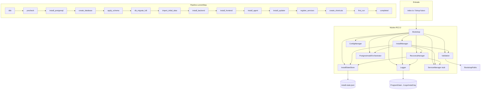

# RC2 Bootstrap — documentação técnica

**Fonte operacional:** `docs/RC2_BASELINE.md` (**RC2-BASELINE-1.0.0**)  
**Referência estratégica:** `docs/ARQUITETURA_INSTALADOR_PROFISSIONAL_RC2.md` (**RC2-ARCH-1.0.0**)  
**Pacote:** `rc2/bootstrap` (`@pontowebdesk/rc2-bootstrap` **`0.2.0-rc2.2`**)  
**Fase baseline:** **`rc2.2-baseline`** — pipeline RC2.1 + PostgreSQL embarcado RC2.2 (steps app deferidos)

---

## 1. Diagrama de componentes



### Estados coarse × etapas

| `state` | Etapas `currentStep` |
|---------|----------------------|
| `NOT_STARTED` | `idle` |
| `PRECHECK` | `precheck` |
| `INSTALLING` | `install_postgresql` … `first_run` |
| `INSTALLED` | `completed` |
| `FAILED` / `RECOVERY` | etapa da falha ou `precheck` pós-rollback stub |

---

## 2. Responsabilidades (SRP)

| Componente | Responsabilidade |
|------------|------------------|
| `Bootstrap` | Composição, modos structural / embedded |
| `InstallManager` | Precheck + pipeline + recovery |
| `InstallStateStore` | `install-state.json`, transições, `currentStep` |
| `installSteps.ts` | Catálogo ordenado de etapas (baseline §11) |
| `ConfigManager` | Paths Program Files / ProgramData |
| `PostgresInstallOrchestrator` | Steps `install_postgresql` … `db_migrate_full` |
| `ServiceManager` | Stub SCM |
| `RecoveryManager` | RECOVERY, rollback parcial stub |
| `Logger` | JSON em `Logs/install.log` |
| `Validation` | Precheck paths + plataforma + redist PG (embedded) |

---

## 3. `install-state.json`

**Campos:** `schemaVersion`, `state`, `currentStep`, `updatedAt`, `architectureVersion`, `phase`, `productVersion`, `history[]`, `lastError?`.

**Valores baseline RC2.2.6 (documentação / templates):**

| Campo | Valor |
|-------|--------|
| `architectureVersion` | `RC2-ARCH-1.0.0` |
| `phase` | `rc2.2-baseline` |
| `productVersion` | `0.2.0-rc2.2` |

**Template:** `schemas/install-state.json`.

---

## 4. Modos e CLI

| Modo | Env / opção |
|------|-------------|
| Estrutural | default / `RC2_BOOTSTRAP_MODE=structural` |
| Embedded PG | `RC2_BOOTSTRAP_MODE=embedded` |
| PG stub | `RC2_BOOTSTRAP_PG_STUB=1` |

- **CLI:** `node dist/index.js` — JSON + exit code.
- **Falha simulada:** `RC2_BOOTSTRAP_FAIL_STEP=apply_schema` ou `simulateFailureAtStep`.

---

## 5. Limites RC2.2 (não RC2.3)

- Steps `import_initial_data` … `first_run`: persistência outline (sem install físico app).
- Rollback **não** remove arquivos nem restaura backup.
- Sem Inno Setup integrado neste pacote.

---

## 6. Build e testes

```powershell
cd rc2/bootstrap
npm install
npm run build
npm test
```

---

## 7. Referências

- `docs/RC2_BASELINE.md`
- `docs/RC2_POSTGRESQL_EMBEDDED.md`
- `docs/RELATORIO_RC2_2_IMPLEMENTACAO.md`
