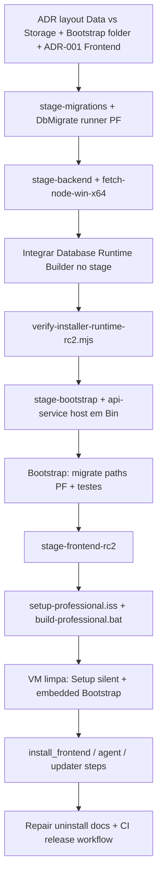

# RC2 — Plano do Instalador Professional (Setup.exe nativo)

**Documento:** `RC2-INSTALLER-PLAN-1.0.0`  
**Data:** 2026-08-06  
**Escopo:** auditoria do repositório e roteiro de implementação — **sem código nesta fase**  
**Objetivo:** substituir o **RC1 Docker** (`PontoWebDesk-Local-Setup.exe`) por um **Setup.exe Windows nativo** que entregue runtime embarcado (PostgreSQL, API, UI, Agent) orquestrado pelo **Bootstrap RC2**.

**Referências normativas:**

| ID | Documento |
|----|-----------|
| RC2-ARCH-1.0.0 | `docs/ARQUITETURA_INSTALADOR_PROFISSIONAL_RC2.md` |
| RC2-BASELINE-1.0.0 | `docs/RC2_BASELINE.md` |
| RC2-LAYOUT-1.0.1 | `docs/RC2_INSTALL_LAYOUT.md` |

---

## 0. Layout alvo (produto) vs baseline congelada

### 0.1 Visão solicitada (objetivo de produto)

```text
C:\Program Files\PontoWebDesk\
    Backend\
    Frontend\
    Database\
    Agent\
    Bin\
    Bootstrap\

C:\ProgramData\PontoWebDesk\
    Data\
    Logs\
    Config\
    Backups\
```

### 0.2 Baseline RC2.2.6 (implementação e docs atuais)

A baseline oficial **expande** a árvore acima e **diverge** em alguns nomes:

| Solicitação | Baseline / código atual | Ação recomendada |
|-------------|-------------------------|------------------|
| `ProgramData\Data\` | `ProgramData\Storage\` (uploads/cache) + `ProgramData\Database\pgdata\` (cluster PG) | **ADR antes do Setup:** ou (A) manter baseline (`Storage` + `Database\pgdata`) e documentar `Data` como alias conceitual; ou (B) renomear `Storage` → `Data` com bump `RC2-LAYOUT` + alterar `api-runtime` (`storageDir`) e backend `UPLOAD_DIR`. **Não implementar renome silencioso.** |
| `Program Files\Bootstrap\` | Bootstrap = pacote npm `rc2/bootstrap` (`pwd-rc2-bootstrap`); layout doc coloca **Launcher/DbMigrate** em `Bin\`, não pasta `Bootstrap\` | **ADR:** pasta `Bootstrap\` com `node.exe` + `dist` + deps empacotadas **ou** executável único `Bin\PontoWebDesk.Bootstrap.exe` que encapsula o CLI. Setup deve invocar **um** entrypoint estável pós-install. |
| Pastas omitidas na visão | `Migrations\`, `Updater\`, `VERSION`, manifests, `Uninstall.exe` | Incluir no Setup Professional conforme `RC2_INSTALL_LAYOUT.md` (obrigatório para migrate/repair). |

**Regra de conflito:** paths operacionais em `ConfigManager` / `defaultApiRuntimePaths` / homologação seguem **RC2-BASELINE** até ADR explícita.

---

## 1. Resumo executivo

| Área | Maturidade | Bloqueia Setup.exe? |
|------|------------|---------------------|
| Bootstrap + InstallManager | PG embedded + `install_backend` (API SCM) **implementados**; demais steps **deferred** | **Parcial** — engine existe; falta payload PF + steps frontend/agent/updater/shortcuts |
| api-runtime | **Pronto** (health 3011, logs, validação) | **Sim** — depende de `Backend\` empacotado |
| api-service | **Pronto** (SCM `PontoWebDeskApi`) | **Sim** — depende de Node redist + `Bin\api-service-host.js` |
| Database Runtime Builder | **Pronto** (PG 16.8 redist) | **Sim** — artefato não entra no pipeline de release |
| Frontend production | **Script existe** (`vite build` → `dist/`), **sem** pipeline para `Frontend\www` | **Sim** |
| Agent runtime | **Script existe** (`dist/rep-agent.exe`), instalador **separado** (REP), não layout `Agent\REP` | **Sim** |
| Inno / staging RC2 | **Inexistente** (`setup-professional.iss` só na arquitetura) | **Sim** |
| Homologação E2E | **REPROVADO** (sem redist PG em PF) | **Sim** |

**Veredito:** o repositório possui **infraestrutura RC2.2–RC2.3.2** sólida para orquestração pós-cópia de arquivos, mas **não possui** pipeline de empacotamento, layout físico provisionado nem Setup.exe Professional. O instalador operacional de campo continua sendo **RC1 Local + Docker** (`installer/setup.iss`, `build-installer.bat`).

---

## 2. Auditoria por componente

### 2.1 Bootstrap (`rc2/bootstrap`)

**Pacote:** `@pontowebdesk/rc2-bootstrap` `0.2.0-rc2.2`  
**Entry:** `pwd-rc2-bootstrap` → `dist/index.js`  
**Modos:** `RC2_BOOTSTRAP_MODE=structural` (dry run) | `embedded` (install real)

**Estado:**

- `ConfigManager` fixa paths RC2: `Program Files\PontoWebDesk\Database\{bin,tools}`, `ProgramData\...\Database\pgdata`, `Config\{backend.env,secrets.json}`, `Logs\`.
- `InstallState` + schema `rc2.2-baseline` / `0.2.0-rc2.2`.
- `Validation.runPrecheck`: plataforma win32/x64; com embedded exige redist PG em PF + `repoRoot/backend/scripts/apply-full-database.mjs` (**acoplamento dev/monorepo** — gap de produção).
- `PostgresInstallOrchestrator`: steps `install_postgresql` … `db_migrate_full` executáveis em embedded.
- `InstallManager.executeStep`: PG + `install_backend` reais quando flags corretas; **todos os outros** steps logam `pipelineStep (deferred RC2.2+)`.
- `register_services`: apenas registra nome lógico PostgreSQL; integração SCM PG completa via orchestrator em outros fluxos.
- Integração API: `loadBackendInstallPort()` → `@pontowebdesk/api-service` (devDependency file: link — **não é layout de cliente**).

**Testes:** vitest bootstrap (16/16 citados em relatórios RC2.3.2).

**Gaps para Setup Professional:**

- Bootstrap **não é copiado** para PF em nenhum script.
- `repoRoot` default aponta para monorepo (3 níveis acima de `dist`) — migrate em máquina cliente **falha** sem `Migrations\` + DbMigrate ou env `RC2_REPO_ROOT`.
- Sem modo **repair** / **verify-runtime** exposto ao Setup.
- Pasta `Bootstrap\` do objetivo de produto **não** mapeada no layout congelado.

---

### 2.2 InstallManager (`rc2/bootstrap/src/InstallManager.ts`)

**Pipeline (`INSTALLING_PIPELINE_STEPS`):**

| Step | Execução atual (embedded + stubs off) |
|------|----------------------------------------|
| `install_postgresql` … `db_migrate_full` | **Real** (PostgresInstallOrchestrator) |
| `install_backend` | **Real** se `backendInstall` carregado (api-service) |
| `install_frontend`, `install_agent`, `install_updater`, `import_initial_data`, `create_shortcuts`, `first_run` | **Deferred** (log only) |
| `register_services` | Parcial (postgresql name); API já registrada em `install_backend` |

**Gaps:**

- Steps deferred precisam de ports/implementação ou stubs explícitos no instalador (ex.: frontend estático + serviço web ou ADR-001 API serve `www`).
- `import_initial_data` / seed não ligados ao pacote `Migrations\` ou SQL inicial em PF.
- Coerência **install-state** ↔ uninstall/repair Inno ainda não especificada em scripts.

---

### 2.3 api-runtime (`rc2/api-runtime`)

**Pacote:** `0.1.0-rc2.3.1`  
**Responsabilidade:** ProcessRunner (`Backend\server\dist\server.js`), env (`Config\backend.env`), health HTTP **3011** (`/api/health/live|ready`, `/api/version`), log `Logs\api-runtime.log`.

**Paths (`paths.ts`):** alinhados ao layout Professional (`Backend\node\node.exe`, `ProgramData\Storage`, etc.).

**Estado:** implementação e testes **completos** para RC2.3.1; **sem** empacotamento Node/backend no repositório de release.

**Gaps:**

- Setup deve garantir árvore `Backend\` antes de qualquer `ApiRuntime.start()`.
- Frontend não coberto (documentado RC2.3.3+).

---

### 2.4 api-service (`rc2/api-service`)

**Pacote:** `0.1.0-rc2.3.2`  
**Serviço:** `PontoWebDeskApi` via `sc.exe` / `net`  
**binPath:** `{Backend\node\node.exe} {Bin\api-service-host.js}`  
**Recovery:** 5s / 30s / 60s

**Estado:** install/uninstall/start/stop/validate + integração Bootstrap `install_backend` **implementados**; testes PASS.

**Gaps:**

- `writeServiceHostFromDist()` copia `serviceHost.js` para `Bin\` — requer **build + staging** no pipeline.
- Node redist em `Backend\node\` **não** existe script de download/verificação no repo (só especificado no layout).
- Serviço PG `PontoWebDeskPostgreSQL` — orchestrator Bootstrap; validar ordem install (PG antes API) no `[Run]` Inno + Bootstrap.

---

### 2.5 Database Runtime Builder (`rc2/database-runtime-builder`)

**Pacote:** `0.1.0-rc2.2.5`  
**CLI:** `pwd-db-runtime-build` — `build` / `validate`  
**Saída default:** `dist-runtime/Database\` (bin, lib, share, locale, licenses, tools, VERSION, manifest.json)  
**Pin:** PostgreSQL **16.8**

**Estado:** builder + validator + testes (14/14) **completos**; documentação `RC2_DATABASE_RUNTIME_BUILDER.md`.

**Gaps:**

- Artefato **não** versionado no git (correto); **não** há step CI/release que produza blob assinado para Inno.
- Homologação VM **FAIL** até copiar redist para `C:\Program Files\PontoWebDesk\Database\`.
- Licenciamento/redist EDB — processo manual documentado; gate legal no pipeline de release.

---

### 2.6 Frontend production build

**Scripts raiz (`package.json`):**

- `build` / `build:production` → `vite build --mode production`
- **outDir:** `dist/` (raiz do monorepo), **não** `Frontend\www\`

**Estado:**

- Capacidade de build **existe** no monorepo.
- Nenhum `dist/` commitado (gitignore) — esperado.
- Docker RC1 serve frontend via container dev/prod compose; **não** espelha layout RC2 estático.
- ADR-001 (UI servida pela API vs serviço `PontoWebDeskWeb`) **pendente** para Setup completo.

**Gaps:**

- Script `stage-frontend-rc2.mjs` (ou equivalente) copiando `dist/` → staging `Frontend\www\`.
- Variáveis `VITE_*` de produção embutidas no build (secrets/c URLs) — política de config pós-install.
- Integração Bootstrap step `install_frontend`.

---

### 2.7 Agent runtime

**Script:** `npm run build:agent` → `scripts/build-rep-agent-exe.mjs` → `dist/rep-agent.exe` (esbuild + pkg, Node 18 win-x64).

**Instalador existente:** `installer/setup-rep-agent-exe.iss` / `rep-agent.iss` — produto **separado**, paths legados (`C:\PontoWebDeskAgent`, serviço `PontoWebDeskAgent`), **não** `Program Files\PontoWebDesk\Agent\REP\`.

**Estado:** agente REP empacotável; **desalinhado** do layout Professional RC2.

**Gaps:**

- Staging para `Agent\REP\` + serviço SCM nome/version RC2 (baseline vs legado).
- Bootstrap step `install_agent`.
- Coexistência com instalações REP antigas (upgrade/uninstall).

---

### 2.8 Scripts de build existentes

| Script | Propósito | Alvo |
|--------|-----------|------|
| `scripts/sync-installer-runtime.mjs` | Pack RC1 → `SaaS-Demo` + espelho Demo | **RC1 Docker** |
| `scripts/verify-installer-runtime.mjs` | Paridade RC1 (docker-compose, migrations list) | **RC1** |
| `scripts/_pack_saas_demo.mjs` | Conteúdo SaaS-Demo | **RC1** |
| `installer/build-installer.bat` | Staging + ISCC `setup.iss` | **PontoWebDesk-Local-Setup.exe** |
| `installer/build-updater.bat` | Updater RC1 Local | **RC1** |
| `scripts/build-rep-agent-exe.mjs` | `dist/rep-agent.exe` | REP standalone |
| `backend/package.json` `release` | `npm run build` backend | Container / dev — **não** staged para PF |
| `rc2/database-runtime-builder` `npm run build` + CLI | Redist PG | Manual → `dist-runtime/` |
| `rc2/*/npm run build` | Pacotes TS RC2 | Desenvolvimento |

**Ausentes (citados na arquitetura, não no tree):**

- `installer/setup-professional.iss`
- `installer/build-professional.bat` (ou equivalente)
- `scripts/stage-rc2-professional.mjs`
- `scripts/verify-installer-runtime-rc2.mjs`
- Script de **Node.js redist** para `Backend\node\`
- Script de **DbMigrate** / `PontoWebDesk.DbMigrate.exe` → `Bin\`
- Pipeline **Migrations\** manifest a partir de `backend/db/migrations` + supabase

---

### 2.9 Estrutura atual de release

| Artefato | Status no repositório |
|----------|-------------------------|
| `installer/dist-installer/` | **Vazio / não versionado** (output local do ISCC) |
| `installer/staging/` | Gerado por `build-installer.bat` (RC1) |
| `SaaS-Demo/` / `PontoWebDesk-Demo/` | Runtime Docker RC1 (gerado por sync) |
| Pacotes `rc2/*` | Código-fonte; **sem** artefato único “Professional runtime zip” |
| CI (`.github/workflows/enterprise-governance.yml`) | Governança; **sem** job de Setup RC2 |
| Homologação | `HOMOLOGACAO_RC2_2_VM_REAL.md` — **REPROVADO** (PF sem Database redist) |

**RC1 vs RC2 coexistência (baseline):**

- RC1: `%ProgramFiles%\PontoWebDesk\Local\` + `%ProgramData%\PontoWebDesk\Local\`
- RC2: `%ProgramFiles%\PontoWebDesk\` (sem `\Local`) — Setup Professional **não** deve sobrescrever RC1 sem ADR.

---

## 3. Gaps consolidados para Setup Professional

### 3.1 P0 — Bloqueadores absolutos

1. **Pipeline de staging RC2** que monte árvore PF/PD inicial (binários) antes do Bootstrap.
2. **Inno Setup RC2** (`setup-professional.iss`): copiar PF, criar PD, ACLs, atalhos, serviços pré-requisito, `[Run]` Bootstrap embedded.
3. **PostgreSQL redist** integrado ao build (Builder → staging `Database\`).
4. **Backend runtime** em `Backend\{node,server,shared}` (`npm run release` + prune + Node win-x64).
5. **Desacoplar migrate do monorepo:** `Migrations\` em PF + runner (`Bin\DbMigrate` ou script empacotado); ajustar `Validation.validateRepoForMigrate` / `DbMigrateRunner` para paths PF (**alteração Bootstrap** — planejar bump baseline).
6. **verify-installer-runtime-rc2** em CI release host.

### 3.2 P1 — Produto mínimo utilizável

7. **Frontend** `Frontend\www\` + step `install_frontend` + ADR-001 (servir estático).
8. **Bootstrap empacotado** (`Bootstrap\` ou launcher em `Bin\`) invocado pelo Setup com elevação.
9. **Ordem de serviços:** PG → migrate → API → (web/agent).
10. **Homologação VM limpa** repetível (script evidência).

### 3.3 P2 — Professional completo

11. **Agent** layout `Agent\REP\` + serviço + step `install_agent`.
12. **Updater** (`Updater\`) + step `install_updater` (RC2.4 parcial).
13. **Repair / uninstall** Inno: preservar `pgdata`/`Config`, remover SCM, rollback docs.
14. **layout.manifest.json** + `install.catalog.json` + assinatura de artefatos.
15. **Reconciliação `Data` vs `Storage`** se exigido pelo produto (ADR).

---

## 4. Arquivos a criar

| Arquivo | Função |
|---------|--------|
| `docs/RC2_INSTALLER_PROFESSIONAL_PLAN.md` | Este plano (mantido) |
| `installer/setup-professional.iss` | Inno RC2 — `PontoWebDesk-Setup.exe` (nome final ADR) |
| `installer/build-professional.bat` | Orquestra build host: PG, backend, frontend, agent, rc2 packages, staging, ISCC |
| `installer/scripts/install-professional.ps1` | Pós-copy: ACL ProgramData, firewall opcional, invoca Bootstrap |
| `installer/scripts/uninstall-professional.ps1` | Stop SCM, preservação dados, cleanup PF |
| `scripts/stage-rc2-professional.mjs` | Monta `installer/staging-professional/` espelhando RC2-LAYOUT |
| `scripts/verify-installer-runtime-rc2.mjs` | REQUIRED files: Database VERSION/manifest, Backend server.js, Frontend index.html, Bin hosts, Migrations, VERSION produto |
| `scripts/fetch-node-win-x64.mjs` (ou similar) | Node LTS pinned → `Backend\node\` |
| `scripts/stage-backend-rc2.mjs` | `backend npm run release` + prod node_modules → staging |
| `scripts/stage-frontend-rc2.mjs` | vite build → `Frontend/www` |
| `scripts/stage-bootstrap-rc2.mjs` | Bundle bootstrap + api-service + api-runtime deps para `Bootstrap\` ou `Bin\` |
| `scripts/stage-migrations-rc2.mjs` | `Migrations\` + manifest.json |
| `docs/HOMOLOGACAO_RC2_SETUP_E2E.md` | Checklist VM + evidências |
| `docs/ADR_RC2_FRONTEND_SERVE.md` (se ADR-001 fechar) | Decisão UI estática |
| `.github/workflows/rc2-installer-release.yml` (opcional) | CI build + verify (Windows runner) |

**Executáveis futuros (build host):**

- `Bin/PontoWebDesk.DbMigrate.exe` (wrapper Node/pkg ou C# host)
- `Bin/PontoWebDesk.Launcher.exe` (opcional RC2.3)
- `Bin/PontoWebDesk.Bootstrap.exe` (opcional — simplifica `[Run]`)

---

## 5. Arquivos a alterar

| Arquivo | Alteração prevista |
|---------|-------------------|
| `package.json` (raiz) | Scripts `installer:stage-rc2`, `installer:build-professional`, `installer:verify-rc2` |
| `rc2/bootstrap/src/Validation.ts` | Precheck migrate contra `Program Files\...\Migrations\` (não só `repoRoot`) |
| `rc2/bootstrap/src/postgres/DbMigrateRunner.ts` (e relacionados) | Invocar DbMigrate/Bin ou paths PF |
| `rc2/bootstrap/src/ConfigManager.ts` | Opcional: `migrationsDir`, `bootstrapDir` se pasta `Bootstrap\` oficializada |
| `rc2/bootstrap/src/InstallManager.ts` | Implementar steps `install_frontend`, `install_agent`, … ou delegar a módulos RC2.3.x |
| `rc2/bootstrap/package.json` | Dependências de produção (api-service) no bundle staged — **não** só devDependency |
| `docs/RC2_BASELINE.md` | Bump quando layout/pipeline installer congelado |
| `docs/RC2_BOOTSTRAP.md` | Fluxo Setup.exe ↔ Bootstrap CLI |
| `installer/README-INSTALLER.md` | Seção RC2 Professional vs RC1 Local |
| `docs/HOMOLOGACAO_RC2_2_VM_REAL.md` | Referenciar re-test após Setup (não substituir — append gate E2E) |

**Manter congelados até ADR (minimizar diff):**

- Lógica PG embedded já homologada em código — alterar só para paths PF migrate.
- `installer/setup.iss` — **RC1 congelado**; parallel `setup-professional.iss`.

---

## 6. Ordem correta de implementação

Ordem pensada para **reduzir risco** e **destravar homologação** cedo:



**Fases numeradas:**

1. **RC2.4.0 — Build host:** migrations stage, Node redist, backend release stage, PG builder hook, verify-rc2 script.  
2. **RC2.4.1 — Bootstrap produção:** remover dependência `repoRoot` para migrate; testes integração staging temp dir.  
3. **RC2.4.2 — Inno mínimo:** copiar PF, criar PD, `[Run]` Bootstrap embedded, serviços PG+API.  
4. **RC2.4.3 — Frontend + Launcher:** ADR-001, step `install_frontend`, smoke browser.  
5. **RC2.4.4 — Agent REP no layout Professional:** stage + SCM + uninstall coexistência legado.  
6. **RC2.4.5 — Updater/Repair/Manifests:** alinhamento arquitetura RC2.4+.

---

## 7. Riscos técnicos

| Risco | Severidade | Mitigação |
|-------|------------|-----------|
| **Migrate acoplado ao monorepo** (`repoRoot`, `apply-full-database.mjs`) | **Crítica** | `Migrations\` + DbMigrate em PF; alterar Validation/DbMigrateRunner; testes staging |
| **Porta 5432 / PG externo** conflita com embedded | **Alta** | Precheck porta; doc uninstall PG externo; configurar porta não-padrão (ADR pendente) |
| **Node como serviço Windows** (api-service) | **Média** | Já RC2.3.2; monitorar recovery; RC2.3.3 host nativo se necessário |
| **Tamanho do Setup** (PG + Node + backend node_modules + agent pkg) | **Alta** | Compressão Inno solid; chunk opcional; download híbrido (Updater) — ADR |
| **Licença PostgreSQL EDB redist** | **Alta** | Processo legal + `Database\licenses\`; gate CI manual |
| **Secrets / `backend.env` templates** | **Alta** | Setup gera `secrets.json` + env; nunca embutir prod secrets no artefato |
| **Coexistência RC1 Local + RC2 Professional** | **Média** | Paths distintos; precheck Docker vs native; documentar |
| **Frontend env baked at build time** | **Média** | Config runtime via API ou `config.json` em PD |
| **Agent legado `PontoWebDeskAgent`** | **Média** | Migração/uninstall detect no Setup |
| **Homologação “host dev” inválida** | **Alta** | Obrigar VM limpa + artefato CI; reproduzir `PG_BINARY_MISSING` resolvido |
| **Bootstrap devDependency api-service** | **Média** | Stage deve incluir pacote resolvido; evitar `import()` falhar no cliente |
| **Assinatura código / SmartScreen** | **Média** | Certificado Authenticode no Setup.exe e binários principais (processo release) |
| **Divergência `Data\` vs baseline** | **Média** | ADR antes de codificar paths |

---

## 8. Critérios de aceite (Setup Professional RC2)

1. `PontoWebDesk-Setup.exe` (ou nome ADR) instala em `%ProgramFiles%\PontoWebDesk\` **sem Docker**.  
2. `%ProgramData%\PontoWebDesk\` criado com `Config`, `Logs`, `Database\pgdata` (e `Storage` ou `Data` conforme ADR).  
3. Serviços **`PontoWebDeskPostgreSQL`** e **`PontoWebDeskApi`** em execução após install; health **3011** ready.  
4. UI acessível conforme ADR-001 (browser + URL documentada).  
5. `node scripts/verify-installer-runtime-rc2.mjs` **PASS** no staging pré-ISCC.  
6. Homologação E2E documentada **APROVADO** em VM limpa.  
7. RC1 Local permanece buildável **sem regressão** (`build-installer.bat`).

---

## 9. Referências de código (pontos de ancoragem)

| Componente | Caminho |
|------------|---------|
| Pipeline steps | `rc2/bootstrap/src/installSteps.ts` |
| Orquestração install | `rc2/bootstrap/src/InstallManager.ts` |
| Paths PF/PD | `rc2/bootstrap/src/ConfigManager.ts` |
| API paths | `rc2/api-runtime/src/paths.ts` |
| SCM API | `rc2/api-service/src/ServiceInstaller.ts` |
| PG redist CLI | `rc2/database-runtime-builder/src/cli.ts` |
| Instalador RC1 | `installer/setup.iss`, `installer/build-installer.bat` |
| Layout normativo | `docs/RC2_INSTALL_LAYOUT.md` |

---

## 10. Próximo passo recomendado (pós-aprovação deste plano)

1. Fechar **ADR** curtos: pasta `Bootstrap\`, `Data` vs `Storage`, ADR-001 frontend.  
2. Implementar **Fase RC2.4.0** (staging + verify-rc2) **sem** Inno — validar árvore PF localmente.  
3. Só então **`setup-professional.iss`** + primeira VM gate.

**Este documento não autoriza implementação automática** — aguarda revisão explícita do time.

---

## 11. RC2.4.0 STATUS — Professional Installer Foundation

**Marco:** `RC2.4.0` (staging + verify, **sem** Inno Setup)  
**Data:** 2026-08-06

### Implementado

| Item | Artefato |
|------|----------|
| Staging `dist-installer/PontoWebDesk-Professional/` | `scripts/stage-rc2-professional.mjs` |
| Caminhos compartilhados | `scripts/rc2-professional-paths.mjs` |
| Validação pós-stage | `scripts/verify-installer-runtime-rc2.mjs` |
| Manifest de layout | `layout.manifest.json` (gerado no staging) |
| Metadado ProgramData / pgdata | `Config/expected-programdata.json` (gerado no staging) |
| Comandos npm | `npm run stage:rc2`, `npm run stage:rc2:partial`, `npm run verify:rc2` |
| Gitignore artefato local | `dist-installer/` na raiz |

**Responsabilidades do stage:**

- Limpar staging anterior
- `Backend`: `npm run release` (se necessário), `Backend/server` com `npm ci --omit=dev`, Node em `Backend/node/node.exe`, `master-contract` em `Backend/shared`
- `Bin/api-service-host.js` (build `rc2/api-service`)
- `Database/` a partir de `RC2_DATABASE_RUNTIME_DIR` ou `rc2/database-runtime-builder/dist-runtime/Database`
- `Frontend/www/` a partir de `vite build` (`dist/`)
- `Agent/rep-agent.exe` a partir de `npm run build:agent`
- `Config/templates/*`, `VERSION`, `layout.manifest.json`

**Flags:** `--build` (força rebuilds), `--allow-missing-database` ou `RC2_ALLOW_MISSING_DATABASE=1` (stage parcial sem PG). Atalho: `npm run stage:rc2:partial`.

### Pendente (pós RC2.4.0)

| Item | Fase |
|------|------|
| `setup-professional.iss` + `build-professional.bat` | RC2.4.2 |
| Bootstrap empacotado / migrate desacoplado do monorepo | RC2.4.1 |
| `scripts/fetch-node-win-x64.mjs` (Node pinado independente do host) | RC2.4.0+ |
| `Migrations/` no staging | RC2.4.1 |
| `Bin/PontoWebDesk.DbMigrate.exe` | RC2.4.1 |
| CI Windows `rc2-installer-release.yml` | RC2.4.2 |
| Homologação VM E2E | RC2.4.2 |

### Próximos passos

1. No build host: gerar PG com Runtime Builder → `npm run stage:rc2` → `npm run verify:rc2` (**PASS**).
2. RC2.4.1 — staging de `Migrations/` + ajuste Bootstrap (`repoRoot` → PF).
3. RC2.4.2 — Inno Setup copiando `dist-installer/PontoWebDesk-Professional/` para `%ProgramFiles%\PontoWebDesk\`.

---

## 12. RC2.4.1 STATUS — Bootstrap Production Runtime

**Marco:** `RC2.4.1`  
**Data:** 2026-08-06

### Implementado

| Item | Local |
|------|--------|
| `LayoutResolver` / `RuntimePathResolver` / `InstallationContext` | `rc2/api-runtime/src/installLayout/` |
| `BootstrapPaths` sem `repoRoot` | `rc2/bootstrap/src/runtime/bootstrapPaths.ts` |
| `ConfigManager` via `layout.manifest.json` | `rc2/bootstrap/src/ConfigManager.ts` |
| Migrate instalado (`RC2_MIGRATIONS_ROOT` + `Bin/apply-installed-database.mjs`) | `rc2/bootstrap/scripts/`, `DbMigrateRunner` |
| `api-service` paths via manifest / `apiServicePathsFromResolved` | `rc2/api-service/src/ServiceConfig.ts` |
| PostgreSQL bin dir via componente `database` do manifest | `RuntimePathResolver` |
| CLI `bootstrap doctor` | `node rc2/bootstrap/dist/index.js doctor` |
| Testes layout + doctor | `rc2/bootstrap/tests/installLayout.test.ts` |
| Stage: `Migrations/`, migrate runner, manifest `programData` | `scripts/stage-rc2-professional.mjs` |

### Pendente

- Homologação migrate E2E em VM com staging completo
- RC2.4.2 Inno Setup

### Comando doctor

```powershell
cd rc2\bootstrap
npm run build
node dist/index.js doctor
# overrides:
$env:RC2_PROGRAM_FILES_ROOT="D:\...\PontoWebDesk-Professional"
$env:RC2_PROGRAM_DATA_ROOT="D:\...\ProgramData\PontoWebDesk"
node dist/index.js doctor
```

---

## 13. RC2.4.2 STATUS — InstallManager Complete Pipeline

**Marco:** `RC2.4.2` — pipeline Bootstrap completo (sem Setup.exe).

### Implementado

- `InstallPipelineExecutor` executa todos os steps de `INSTALLING_PIPELINE_STEPS`
- PostgreSQL via orchestrator existente (modo `full`); stub em testes
- `import_initial_data`, `install_backend`, `install_frontend`, `install_agent`, `install_updater` (outline), `register_services`, `create_shortcuts`, `first_run`
- `install-state.json`: `completedSteps`, `startedAt`, `finishedAt`, `errors[]`
- Rollback: para serviços iniciados + logs em `RecoveryManager`

## 14. RC2.4.3 STATUS — Professional Installer (Inno Setup)

**Marco:** `RC2.4.3` — primeiro `dist-installer/Setup.exe` a partir **somente** do staging `npm run stage:rc2`.

### Implementado

| Item | Caminho |
|------|---------|
| Script Inno | `installer/PontoWebDeskProfessional.iss` |
| Pós-install / rollback / uninstall | `installer/scripts/professional-*.ps1` |
| Assinatura (placeholder) | `installer/assets/codesign.placeholder.txt` |
| Pipeline build | `scripts/build-professional-installer.bat` → `stage:rc2` → `verify:rc2` → ISCC → `Setup.exe` |
| Log instalador | `%ProgramData%\PontoWebDesk\Logs\installer.log` |
| Bootstrap no staging | `Bootstrap/dist/index.js` + `@pontowebdesk/api-service` (runtime) |
| Versão Setup | `installer/rc2-staging-version.inc` (sync com `VERSION` do staging no build) |

### Comportamento Setup

- **Program Files:** `{commonpf}\PontoWebDesk` — cópia recursiva do staging
- **ProgramData:** `{commonappdata}\PontoWebDesk` — Config, Logs, Storage, Backups, `Database\pgdata`
- **[Run]:** `professional-install.ps1` → Bootstrap `RC2_BOOTSTRAP_MODE=embedded` (PostgreSQL + API Service + **Frontend Service**)
- **Atalhos:** menu Iniciar / Área de trabalho → `http://127.0.0.1:3010/`
- **Desinstalação:** `professional-uninstall.ps1` (para/remove serviços SCM)
- **Inno:** `/SILENT`, `/VERYSILENT`, `/LOG=...`, `SetupLogging=yes`
- **Rollback:** falha no Bootstrap → `professional-rollback.ps1` + logs

### Pendente

- Homologação E2E em VM Windows limpa (com Database runtime completo no stage)
- Assinatura Authenticode em pipeline de release
- Atalhos `.url` físicos além de manifest Bootstrap (opcional)

### Comandos

```bat
scripts\build-professional-installer.bat
```

```bat
dist-installer\Setup.exe /VERYSILENT /NORESTART /LOG=%TEMP%\pwd-professional-inno.log
```

---

## 15. RC2.4.3.1 STATUS — Frontend Runtime Lifecycle

**Marco:** `RC2.4.3.1` — serviço Windows **`PontoWebDeskFrontend`** na porta **3010**, instalado e validado pelo **Bootstrap** (autoridade única; Inno Setup não duplica lógica).

### Cadeia após instalação bem-sucedida

```
PostgreSQL → PontoWebDeskApi :3000 → PontoWebDeskFrontend :3010
```

### Serviço SCM

| Campo | Valor |
|-------|--------|
| Nome | `PontoWebDeskFrontend` |
| DisplayName | `PontoWebDesk Frontend` |
| Executável | `{installRoot}\Backend\node\node.exe` |
| Script | `{installRoot}\Bin\serve-frontend.mjs` |
| Porta | `3010` |
| Start | automático |
| Recovery | restart 5s / 30s / 60s; reset 86400s |
| Config runtime | `%ProgramData%\PontoWebDesk\Config\frontend-service.json` |
| Logs | `%ProgramData%\PontoWebDesk\Logs\frontend-service.log` |

### Implementação (`@pontowebdesk/api-service`)

- `FrontendServiceInstaller` — SC create, `frontend-service.json`, validação de layout
- `FrontendServiceController` — start/stop/query
- `FrontendServiceRecovery` — `sc failure`
- `FrontendServiceValidator` — TCP **3010** + HTTP GET `/` (200)
- `FrontendService` — `installAndStart`, rollback (stop + delete se criado na sessão)
- `createBootstrapFrontendInstall` — ponte Bootstrap

### Pipeline Bootstrap

| Step | Comportamento |
|------|----------------|
| `install_frontend` | Valida `Frontend\www\index.html` e `Bin\serve-frontend.mjs`; instala/inicia serviço; aguarda TCP+HTTP; **sucesso só com 3010 OK** |
| `register_services` | Registra kind `web` → `PontoWebDeskFrontend` |
| `first_run` | Revalida saúde do frontend (modo `full`) |
| Rollback falha | `rollbackFrontend` + `RollbackCoordinator` para `web`; `install-state.json` com erro; logs preservados |

### Setup / desinstalação

- `professional-install.ps1` — apenas Bootstrap embedded (sem `professional-start-frontend.ps1`)
- `professional-rollback.ps1` — inclui stop/delete `PontoWebDeskFrontend`

### Staging / verify

- `npm run stage:rc2` copia `Bin/serve-frontend.mjs`
- `npm run verify:rc2` exige `Bin/serve-frontend.mjs`

### Testes

- `rc2/api-service/tests/FrontendService.test.ts` — install, start/stop, health (HTTP real), rollback, uninstall (SC mock)
- `rc2/bootstrap/tests/pipelineSteps.test.ts` — `install_frontend` full chama port

### Env Bootstrap

| Variável | Efeito |
|----------|--------|
| `RC2_BOOTSTRAP_FRONTEND_SERVICE=0` | Não carrega port frontend |
| `RC2_BOOTSTRAP_FRONTEND_SERVICE_STUB=1` | Stub (structural de serviço) |

---

## 16. RC2.4.3.2 — Release gate (staging + Setup)

**Problema observado em instalação real:** `Setup.exe` antigo ou staging incompleto copiava só parte do layout (`Frontend/www` sem `Bootstrap/dist`, sem `Bin/serve-frontend.mjs`), o Inno concluía a cópia e o utilizador ficava sem serviços SCM.

**Correções no pipeline (sem alterar backend/frontend app):**

| Camada | Comportamento |
|--------|----------------|
| `stage-rc2-professional.mjs` | `serve-frontend.mjs` obrigatório; `STAGING_CRITICAL_FILES` no assert final |
| `verify:rc2` | Falha fechada em qualquer ficheiro crítico (sem warnings para Database) |
| `build-professional-installer.bat` | Bloqueia ISCC se faltar Bootstrap, serve-frontend ou postgres embarcado |
| `PontoWebDeskProfessional.iss` | `#error` em compile-time se staging crítico ausente |
| `professional-install.ps1` | Valida layout em `{app}` antes do Bootstrap; pós-install: serviços + portas 3000/3010 + HTTP 2xx |

**Critério:** não gerar `Setup.exe` nem declarar instalação OK sem PostgreSQL **embarcado** em `{app}\Database` (runtime 16.8 via Builder — não PG externo 16.14/18).

---

