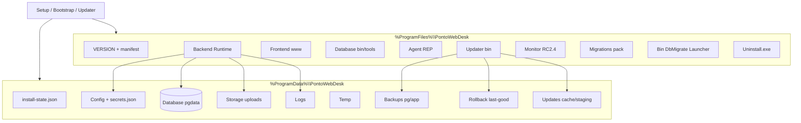
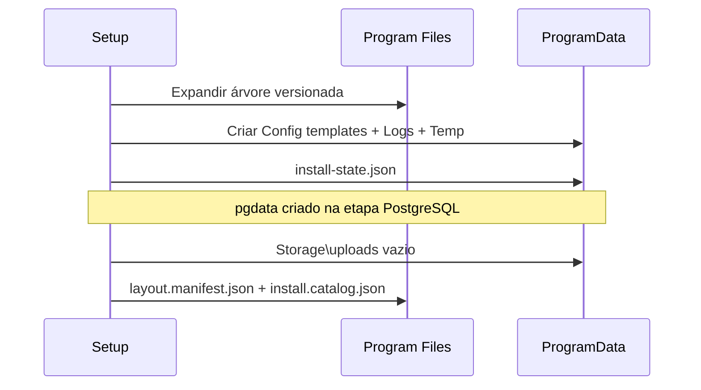

# RC2 — Layout físico de instalação (Professional)

**Versão do layout:** `RC2-LAYOUT-1.0.1` (patch RC2.2.6 — alinhado a `docs/RC2_BASELINE.md`)  
**Referência normativa:** `docs/ARQUITETURA_INSTALADOR_PROFISSIONAL_RC2.md` (**RC2-ARCH-1.0.0**)  
**Fonte operacional única:** `docs/RC2_BASELINE.md` (**RC2-BASELINE-1.0.0**)  
**Bootstrap / estado:** `docs/RC2_BOOTSTRAP.md`, `rc2/bootstrap` (`ConfigManager` paths)  
**Produto:** PontoWebDesk **Professional** (RC2) — coexistente em paths distintos do RC1 **Local**

| Raiz | Caminho padrão |
|------|----------------|
| Binários (imutáveis por versão) | `%ProgramFiles%\PontoWebDesk\` |
| Dados mutáveis / operação | `%ProgramData%\PontoWebDesk\` |

**RC1 (inalterado):** `%ProgramFiles%\PontoWebDesk\Local\` + `%ProgramData%\PontoWebDesk\Local\`

**Escopo deste documento:** definição congelável do layout para RC2.2+ — **sem** implementação de PostgreSQL, serviços, Setup ou scripts.

---

## 1. Princípios

1. **Separação binário × dado:** tudo que vem do pacote assinado fica em **Program Files**; tudo que cresce ou é específico do cliente fica em **ProgramData**.
2. **Fail-closed:** config e segredos **nunca** em Program Files world-readable.
3. **Rollback:** sempre existir par `Backups\` + `Rollback\last-good` antes de swap deversão.
4. **Repair:** revalidar binários + migrate + serviços **sem** apagar `pgdata` nem `Config` do usuário salvo opção explícita.
5. **Uninstall:** remove SCM + Program Files; ProgramData opcional (preservar dados).

---

## 2. Diagrama — visão geral



---

## 3. Árvore completa de diretórios

### 3.1 Program Files (`%ProgramFiles%\PontoWebDesk\`)

```text
C:\Program Files\PontoWebDesk\
├── VERSION                          # versão do produto instalada (texto semver/build)
├── LICENSE.txt
├── layout.manifest.json             # RC2-LAYOUT-1.0.1 + checksums dos componentes
├── install.catalog.json             # inventário para repair/verify (gerado no install)
│
├── Backend\
│   ├── node\                        # Node.js redistribuível (sem instalador nodejs.org)
│   │   └── node.exe
│   ├── server\                      # backend/dist + node_modules produção
│   │   └── dist\
│   └── shared\
│       └── master-contract\         # dist do pacote shared
│
├── Frontend\
│   └── www\                         # vite build (index.html + assets)
│                                   # ADR-001: se opção A, www pode ser espelho servido pela API
│
├── Database\
│   ├── bin\                         # postgres, pg_ctl, initdb, pg_isready, DLLs
│   ├── tools\                       # pg_dump, pg_restore, psql
│   ├── lib\
│   ├── share\
│   ├── locale\
│   ├── licenses\
│   ├── VERSION                      # pin PostgreSQL (16.8)
│   └── manifest.json                # integridade redist PG (Runtime Builder)
│
├── Agent\
│   └── REP\                         # rep-agent empacotado + runtime embutido
│
├── Updater\
│   ├── PontoWebDesk.Updater.exe
│   └── (deps updater-agent empacotadas)
│
├── Monitor\                         # RC2.4+ — pasta presente vazia ou omitida até RC2.4
│   └── PontoWebDesk.Monitor.exe
│
├── Migrations\
│   ├── manifest.json                # versão + lista de arquivos empacotados
│   ├── supabase_full_schema.sql
│   ├── supabase\migrations\
│   └── backend\db\migrations\
│
├── Bin\
│   ├── PontoWebDesk.DbMigrate.exe
│   └── PontoWebDesk.Launcher.exe    # atalho / tray / abrir browser
│
└── Uninstall.exe                    # desinstalador (Inno ou gerado pelo Setup)
```

### 3.2 ProgramData (`%ProgramData%\PontoWebDesk\`)

```text
C:\ProgramData\PontoWebDesk\
├── install-state.json               # máquina de estados Bootstrap (RC2.1+)
├── product.version.json             # espelho operacional (Updater); opcional se VERSION só em PF
│
├── Config\
│   ├── backend.env                  # env operacional (sem segredos plaintext críticos)
│   ├── agent.env                    # REP / tokens locais (referências)
│   ├── updater.env                  # canal update / hybrid
│   ├── secrets.json                 # segredos locais RC2.2 (Bootstrap); migração DPAPI → secrets.dat reservada RC2.3+
│   ├── firewall.rules.json          # regras aplicadas pelo instalador (auditoria)
│   └── templates\                   # cópias default do Setup (recreatável)
│       ├── backend.env.default
│       └── agent.env.default
│
├── Database\
│   └── pgdata\                      # cluster PostgreSQL embarcado (NUNCA remover em repair)
│       └── (conteúdo gerenciado pelo PG)
│
├── Storage\
│   ├── uploads\                     # UPLOAD_DIR — fotos punch, avatars, etc.
│   │   └── files\                   # layout lógico tenant/entity (backend existente)
│   └── cache\                       # cache derivado recriável (thumbnails, geo, etc.)
│
├── Logs\
│   ├── install.log                  # Bootstrap / Setup
│   ├── migrate-*.log                # DbMigrate
│   ├── api.log                      # PontoWebDeskApi stdout/stderr
│   ├── web.log                      # PontoWebDeskWeb (se ADR-001 B)
│   ├── postgresql.log               # PG / pg_ctl
│   ├── rep-agent.log
│   ├── updater.log
│   ├── rollback.log
│   ├── repair.log
│   ├── monitor.log                  # RC2.4+
│   └── quarantine\                  # install-state.corrupt.*.json
│
├── Temp\
│   ├── install\                     # expand MSI/Inno, staging curto
│   ├── migrate\
│   └── updater\
│
├── Backups\
│   ├── pg\
│   │   └── pre-<version>-<timestamp>.dump
│   ├── app\
│   │   └── pre-<version>-<timestamp>\
│   │       ├── Backend\
│   │       ├── Frontend\
│   │       ├── Agent\
│   │       └── Migrations\
│   └── pre-install\
│       └── <timestamp>\             # snapshot antes do first install (rollback install)
│
├── Rollback\
│   ├── last-good\
│   │   ├── VERSION
│   │   ├── manifest.json            # aponta para Backups\app\... + pg dump pareado
│   │   └── install-state.snapshot.json
│   └── history\                     # registro de rollbacks concluídos
│
└── Updates\
    ├── cache\                       # pacotes .pwdupdate / ZIP baixados
    ├── staging\                     # extração antes do swap
    │   └── <version>\
    └── manifest\
        └── remote.json              # último manifest verificado (cache offline)
```

---

## 4. Classificação de conteúdo

### 4.1 Pertence ao **instalador** (Setup / Bootstrap / Updater / Repair)

| Área | Conteúdo |
|------|----------|
| Program Files (inteiro) | Binários versionados, migrations pack, Uninstall |
| ProgramData\Config\templates | Defaults |
| ProgramData\Config\firewall.rules.json | Regras criadas pelo install |
| ProgramData\install-state.json | Orquestração (escrito pelo Bootstrap) |
| ProgramData\Logs\install.log, repair.log | Trilha do instalador |
| ProgramData\Temp\* | Arquivos temporários de install/update |
| ProgramData\Updates\* | Cache/staging de pacotes |
| ProgramData\Backups\* | Criados automaticamente pre-update/install |
| ProgramData\Rollback\* | Metadados de rollback |
| SCM | Registro de serviços Windows |

### 4.2 Pertence ao **usuário / cliente** (dados de negócio e configuração)

| Área | Conteúdo |
|------|----------|
| ProgramData\Database\pgdata | Dados relacionais (empresas, pontos, etc.) |
| ProgramData\Storage\uploads | Arquivos enviados pelos usuários |
| ProgramData\Config\backend.env | Parâmetros escolhidos / first-run (URLs, flags) |
| ProgramData\Config\secrets.json | Segredos locais (Bootstrap RC2.2) |
| ProgramData\Config\agent.env | Credenciais REP após provisionamento |
| ProgramData\Backups\ (retenção) | Política de guarda definida pelo cliente TI |

### 4.3 **Nunca remover** (operación normal / repair)

| Path | Motivo |
|------|--------|
| `ProgramData\Database\pgdata\` | Base de produção |
| `ProgramData\Config\secrets.json` | Segredos install (baseline RC2.2.6) |
| `ProgramData\Config\backend.env` | Config operacional (repair preserva) |
| `ProgramData\Storage\uploads\` | Evidências / fotos |
| `ProgramData\Backups\` (último par válido) | Rollback |
| `ProgramData\Rollback\last-good\` | Ponteiro versão estável |

**Exceção:** Uninstall com opção **“remover todos os dados”** (explícita) ou ferramenta suporte N2.

### 4.4 **Pode recriar** (sem perda de negócio)

| Path | Como recriar |
|------|----------------|
| `Program Files\*` | Repair / reinstall / update swap |
| `ProgramData\Temp\*` | Limpeza segura |
| `ProgramData\Storage\cache\` | Regenerado pela API |
| `ProgramData\Logs\*` (exceto quarantine) | Rotação / delete |
| `ProgramData\Updates\cache\` | Re-download |
| `ProgramData\Config\templates\` | Copiar do pacote |
| `ProgramData\Logs\quarantine\` | Arquivos de diagnóstico antigos |

---

## 5. Permissões e ACL (Windows)

Contas padrão:

| Conta | Uso |
|-------|-----|
| `NT AUTHORITY\SYSTEM` | Serviços Windows |
| `BUILTIN\Administrators` | Install / Repair / Uninstall |
| `PontoWebDeskSvc$` (virtual service SID) | API + DbMigrate (recomendado) |
| `PontoWebDeskPg$` | Serviço PostgreSQL dedicado (opcional isolamento) |

### 5.1 Matriz ACL resumida

| Path | SYSTEM | Administrators | Service account(s) | Users (Authenticated) |
|------|--------|------------------|--------------------|------------------------|
| `Program Files\PontoWebDesk\` | R-X | R-X | R-X | R-X (leitura binários) |
| `ProgramData\PontoWebDesk\Config\` | F | F | R-W (backend.env limitado) | **Deny** |
| `ProgramData\...\secrets.json` | F | F | R | **Deny** |
| `ProgramData\...\pgdata\` | F | F | F (PG service) | **Deny** |
| `ProgramData\...\Storage\uploads\` | F | F | F (API) | **Deny** (acesso só via API) |
| `ProgramData\...\Logs\` | F | F | C-W (append) | R (opcional suporte) |
| `ProgramData\...\Backups\` | F | F | R-W | **Deny** |
| `ProgramData\...\Updates\` | F | F | R-W | **Deny** |
| `ProgramData\...\Temp\` | F | F | F | **Deny** |

**Regras:**

- Herança desabilitada em `Config`, `pgdata`, `secrets.json`, `Backups`.
- Auditoria (opcional RC2.3+): Object Access em `Config` e `Backups`.

### 5.2 Pastas “compartilhadas” entre componentes

Não há SMB compartilhado. **Compartilhamento lógico** (mesmo host):

| Consumidor | Paths lidos/escritos |
|------------|----------------------|
| Bootstrap / Setup | PF inteiro; PD Config, Logs, Temp, install-state |
| DbMigrate | PF Migrations; PD pgdata, Logs migrate |
| API | PF Backend; PD Config, pgdata (via TCP), Storage, Logs |
| Frontend estático | PF Frontend\www **ou** servido pela API (ADR-001) |
| REP Agent | PF Agent; PD agent.env, Logs |
| Updater | PF (swap); PD Updates, Backups, Rollback, Logs |
| Monitor (RC2.4) | PD Logs; health HTTP apenas |

---

## 6. Logs, cache, uploads, backup

### 6.1 Logs

| Arquivo / pasta | Origem | Rotação |
|-----------------|--------|---------|
| `Logs\install.log` | Bootstrap | 10 MB × 5 (política instalador) |
| `Logs\migrate-*.log` | DbMigrate | por execução |
| `Logs\api.log` | NSSM / serviço | 50 MB × 10 |
| `Logs\rollback.log` | Updater | append |
| `Logs\quarantine\` | install-state corrupt | manual suporte |

Redação: reutilizar política `logger.redaction` nos serviços (arch §9).

### 6.2 Cache

| Path | Dono | Conteúdo |
|------|------|----------|
| `Storage\cache\` | API | derivados de upload |
| `Updates\cache\` | Updater | pacotes baixados |
| `Temp\` | Setup/Updater | curta duração |

### 6.3 Uploads

- **Path canônico:** `%ProgramData%\PontoWebDesk\Storage\uploads\`
- **Env:** `UPLOAD_DIR` em `backend.env` apontando para esse path.
- **Proibido:** `UPLOAD_DIR` sob `Program Files` ou path público web.

### 6.4 Backup

| Tipo | Destino | Gatilho |
|------|---------|---------|
| PostgreSQL | `Backups\pg\pre-<ver>-<ts>.dump` | pre-update, pre-migrate destrutivo |
| Aplicação | `Backups\app\pre-<ver>-<ts>\` | pre-update |
| Pré-install | `Backups\pre-install\<ts>\` | first install (rollback install) |

Pareamento obrigatório: mesmo `<ts>` em pg + app para rollback Updater.

---

## 7. Layout por operação

### 7.1 Instalação (first install)



### 7.2 Atualização

```text
Updates\cache\     ← download verificado
Updates\staging\<targetVersion>\  ← extração
Backups\pg + Backups\app  ← snapshot origem
Program Files\     ← swap atômico (Backend, Frontend, Agent, Migrations, Bin)
VERSION            ← bump
Rollback\last-good ← aponta backups pareados
DbMigrate upgrade  → Logs\migrate-*
```

**Não alterar:** `pgdata` in-place (migrate only); `Config\secrets.json` salvo migração de segredos.

### 7.3 Rollback

```text
Parar serviços (REP → API → Web → PG se necessário)
Restaurar Backups\app\pre-* → Program Files (subtrees)
pg_restore ← Backups\pg\pre-* pareado
VERSION + install-state.snapshot ← Rollback\last-good
Logs\rollback.log
Subir serviços PG → API → REP
```

### 7.4 Repair

```text
Preservar: pgdata, Config, Storage\uploads, Backups, Rollback
Reconciliar: Program Files vs layout.manifest.json / install.catalog.json
Reaplicar: DbMigrate (verify + pending migrations)
Re registrar serviços SCM se ausentes
Logs\repair.log
install-state: transição via RecoveryManager → retry pipeline
```

### 7.5 Uninstall

```text
Parar e remover serviços SCM
Remover Program Files\PontoWebDesk\ (inteiro)
Opção A (default recomendado): manter ProgramData (dados cliente)
Opção B: remover ProgramData exceto prompt explícito
Remover regras firewall instalador
Logs finais em install.log / uninstall.log
```

---

## 8. Variáveis de ambiente (mapeamento layout)

| Variável | Path / nota |
|----------|-------------|
| `PWD_PROGRAM_FILES` | `%ProgramFiles%\PontoWebDesk` |
| `PWD_PROGRAM_DATA` | `%ProgramData%\PontoWebDesk` |
| `DATABASE_URL` | host localhost + credenciais em secrets.json |
| `UPLOAD_DIR` | `%ProgramData%\PontoWebDesk\Storage\uploads` |
| `PGDATA` | `%ProgramData%\PontoWebDesk\Database\pgdata` |

Bootstrap RC2.1 já fixa: `install-state.json`, `Logs`, `Config` via `ConfigManager`.

---

## 9. ADR-001 — impacto no layout (Frontend)

| Opção | Program Files | ProgramData | Serviço extra |
|-------|---------------|-------------|---------------|
| **A** — UI via API :3000 | `Frontend\www` servido pelo Backend | — | Não |
| **B** — Web :3010 | `Frontend\www` | — | `PontoWebDeskWeb` |
| **C** — UI em PD | opcional stub PF | `Storage\www\` ou `Frontend\www` | Launcher URL |

**Layout congelado RC2-LAYOUT-1.0.0:** reserva **`Program Files\Frontend\www`** em todas as opções; diferença é **serviço/firewall**, não a árvore base.

---

## 10. Validação contra RC2-ARCH-1.0.0

| Requisito arch (§5, §6, §8, §10, Recuperação) | Layout RC2-LAYOUT-1.0.1 |
|-----------------------------------------------|-------------------------|
| PF: Backend, Frontend, Database bin, Agent, Updater, Monitor, Migrations, Bin | **OK** |
| PD: Config, pgdata, Logs, Temp, Backups, Updates | **OK** (+ Storage, Rollback explícitos) |
| install-state em ProgramData | **OK** (raiz PD) |
| rollback last-good + backups pareados | **OK** (`Rollback\`, `Backups\`) |
| Logs por serviço | **OK** (`Logs\*.log`) |
| Segredos ProgramData | **OK** (`Config\secrets.json`) |
| RC1 paths separados | **OK** (`\Local\`) |
| Monitor RC2.4 | **OK** (pasta reservada) |
| Congelamento: mudança estrutural exige ADR | **OK** (versão RC2-LAYOUT-1.0.1) |

**WARNING:** ADR-001 ainda pendente — árvore PF Frontend fixa; comportamento runtime depende de decisão.

---

## 11. Congelamento e evolução

- Alterações a esta árvore exigem **RC2-LAYOUT-x.y.z** + **ADR** (conforme RC2-ARCH § critérios de congelamento).
- `layout.manifest.json` em Program Files referencia `layoutVersion: "RC2-LAYOUT-1.0.1"`.
- Próximas fases (RC2.2+) implementam cópia física conforme este documento — **sem desviar paths** salvo ADR.

---

## 12. Referências

- `docs/RC2_BASELINE.md` (**RC2-BASELINE-1.0.0** — fonte operacional única)
- `docs/ARQUITETURA_INSTALADOR_PROFISSIONAL_RC2.md`
- `docs/RC2_BOOTSTRAP.md`
- `docs/RELATORIO_RC2_1_FINAL.md`
