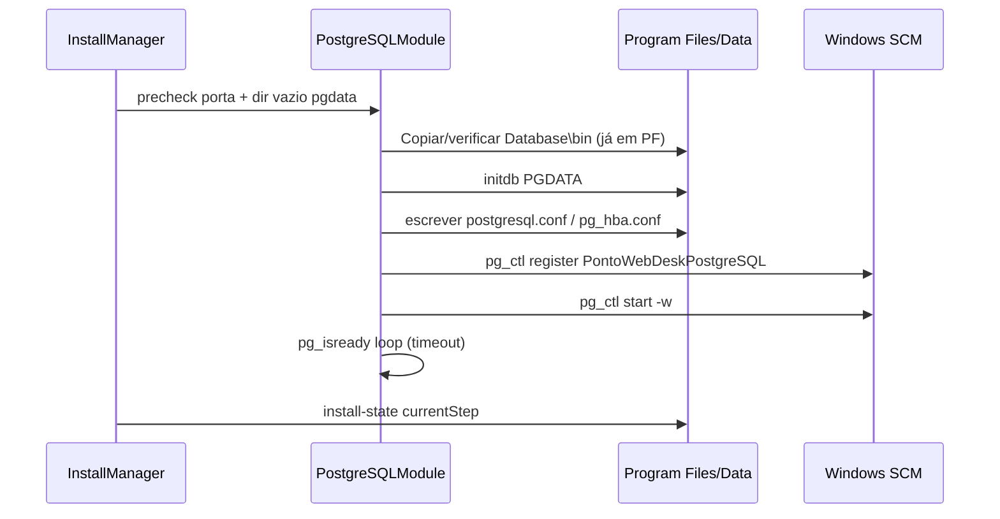
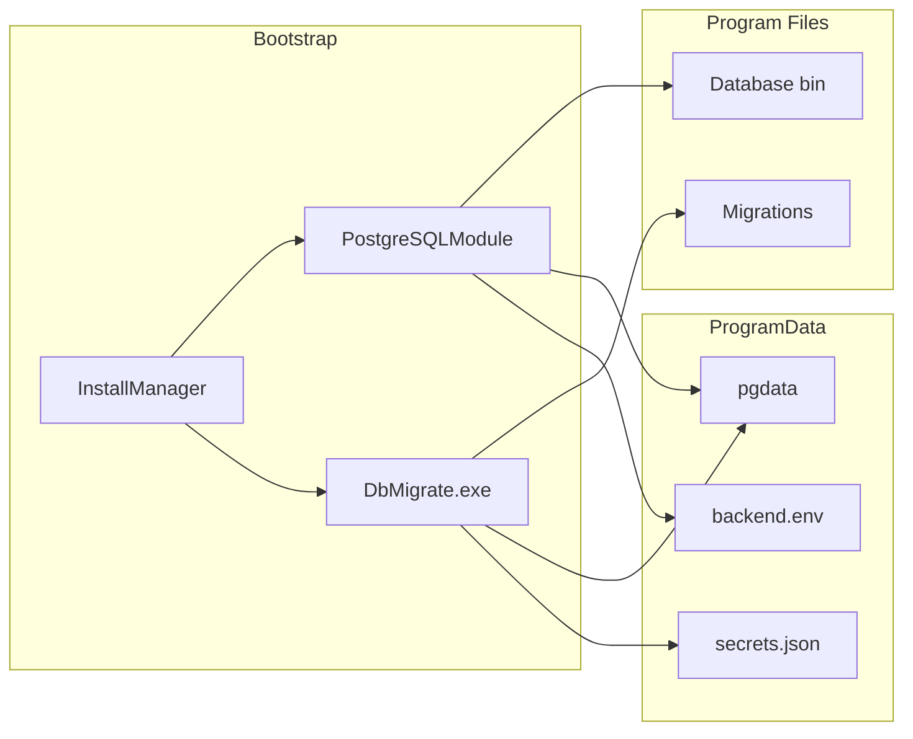

# RC2 — PostgreSQL embarcado (Professional)

**Versão do documento:** `RC2-PG-1.0.1` (patch RC2.2.6 — alinhado a `docs/RC2_BASELINE.md`)  
**Referências:** `RC2-ARCH-1.0.0`, `RC2-LAYOUT-1.0.1`, `RC2_BOOTSTRAP.md`, `RC2_INSTALL_LAYOUT.md`, `RC2_BASELINE-1.0.0`  
**Escopo:** arquitetura para RC2.2 — **sem implementação**, sem Setup, sem alteração de código.

---

## 1. Decisão congelada — versão PostgreSQL

| Item | Decisão |
|------|---------|
| **Major** | **PostgreSQL 16** |
| **Linha RC2 inteira** | Permanece em **16.x** até novo ADR de major bump (produto RC3 ou extensão RC2-LTS) |
| **Minor/patch congelado** | **16.8** (referência inicial RC2.2) — registrar em `layout.manifest.json` + `Database/VERSION` |
| **Arquitetura CPU** | **x64** apenas (amd64); sem ARM64 na RC2.2 |
| **Paridade dev/prod** | Alinhar com `postgres:16-alpine` / `postgres:16` já usados no monorepo (Docker RC1/Demo) |

**Justificativa:** RC2-ARCH §6.1 já fixa PG 16; migrations e dumps do projeto assumem features PG 16; `db:migrate:full` testado nessa linha. Congelar **16.8** evita drift silencioso entre build hosts.

**Regra de upgrade major (fora RC2.2):** usar `pg_upgrade` + nova árvore `Database\bin` empacotada; **não** fazer in-place cross-major no campo.

---

## 2. Comparativo de formas de distribuição

| Abordagem | Silencioso / automatizável | Controle layout RC2 | Tamanho | Serviço Windows | Veredito RC2 |
|-----------|----------------------------|---------------------|---------|-----------------|--------------|
| **MSI oficial (EDB)** | Sim (`/quiet`) | **Baixo** — registry, Add/Remove Programs, paths fixos EDB | Grande | Instala serviço próprio | **Reprovado** como runtime embarcado |
| **ZIP portable (binários EDB)** | N/A (cópia) | **Alto** — `Program Files\PontoWebDesk\Database\bin` | Médio (subset curado) | Registrado pelo Bootstrap (`pg_ctl register`) | **Recomendado** |
| **EnterpriseDB instalador gráfico** | Parcial | Baixo | Grande | Externo ao produto | **Reprovado** |
| **StackBuilder** | Não headless | N/A | N/A | N/A | **Fora de escopo** — não empacotar |
| **Instalador customizado (curated redist)** | Sim (Bootstrap) | **Alto** — único dono do layout | Otimizado (sem doc, sem pgAdmin) | `PontoWebDeskPostgreSQL` | **Escolha oficial RC2.2** |

### 2.1 Conteúdo mínimo do redist (`Database\bin`)

- `postgres.exe`, `pg_ctl.exe`, `initdb.exe`, `pg_isready.exe`
- DLLs dependentes (MSVC runtime empacotado ou prerequisite documentado)
- `share/` (timezone, `postgres.bki`, locales necessários)
- **`Database\tools\`:** `pg_dump.exe`, `pg_restore.exe`, `psql.exe` (Updater/rollback/suporte N2)

### 2.2 Licenciamento

- PostgreSQL **License** (similar BSD) permite redistribuição de binários.
- **WARNING:** validar juridicamente termos EDB quando binários forem obtidos via EDB vs build upstream; registrar SBOM em `layout.manifest.json`.

---

## 3. Instalação silenciosa — cluster bootstrap

### 3.1 Sequência (Bootstrap step `install_postgresql`)



### 3.2 Parâmetros `initdb` (congelados RC2-PG-1.0.0)

| Parâmetro | Valor | Notas |
|-----------|-------|-------|
| **Encoding** | `UTF8` | Obrigatório (JSON, nomes Unicode) |
| **Locale** | `Portuguese_Brazil.1252` (Windows) | Fallback install: `C` se locale indisponível no host |
| **Text search** | `portuguese` ou `simple` | Se `portuguese` indisponível → `simple` |
| **Data checksums** | **on** (`--data-checksums`) | PG 16 default recomendado |
| **Auth local** | `scram-sha-256` | Pós-init via `pg_hba.conf` |
| **Timezone** | `America/Sao_Paulo` | `postgresql.conf` `timezone=` + `log_timezone=` |
| **Collation** | Derivada do locale | DB `pontowebdesk` usa `LC_COLLATE/LC_CTYPE` do cluster salvo ADR futuro ICU |

### 3.3 `postgresql.conf` (baseline RC2)

```ini
listen_addresses = '127.0.0.1'
port = 5432                    # ou valor do precheck / backend.env
max_connections = 100
shared_buffers = 256MB         # ajuste por RAM no precheck futuro
log_destination = 'stderr'
logging_collector = off        # logs via serviço → Logs\postgresql.log
timezone = 'America/Sao_Paulo'
```

### 3.4 `pg_hba.conf` (fail-closed)

```text
# TYPE  DATABASE  USER  ADDRESS       METHOD
local   all       postgres            scram-sha-256
host    all       all   127.0.0.1/32  scram-sha-256
host    all       all   ::1/128       scram-sha-256
```

Sem regras `0.0.0.0/0`. Firewall: apenas localhost (arch §9).

### 3.5 Porta

1. Precheck tenta **5432**.
2. Se ocupado (PostgreSQL corporativo ou RC1): usar **55432** (paridade dev `backend/.env.development`).
3. Persistir em `Config\backend.env` (`PGPORT`, `DATABASE_URL`).

---

## 4. Roles, usuários e permissões

### 4.1 Modelo de roles (step `create_database`)

| Role | Propósito | Privilégios |
|------|-----------|-------------|
| **`postgres`** | Superuser local | Só localhost; senha forte em `Config\secrets.json`; **não** usado pela API em runtime |
| **`pontoweb_migrate`** | DbMigrate / `apply-full-database.mjs` | `CREATEDB` no cluster; no DB `pontowebdesk`: `CREATE`, `ALTER`, migrations DDL; **sem** `SUPERUSER` |
| **`pontoweb_app`** | API (`DATABASE_URL` runtime) | `CONNECT` + DML/SELECT em schemas aplicacionais; **sem** DDL destrutivo; **sem** `SUPERUSER` |

### 4.2 Fluxo de credenciais

1. Install: Bootstrap gera senhas aleatórias → grava `Config\secrets.json`.
2. `create_database`: SQL idempotente (DbMigrate ou script dedicado) — database `pontowebdesk`, extensions (`pgcrypto`, etc. conforme `apply-full-database.mjs`).
3. Pós-migrate: revogar qualquer grant temporário elevado; API usa só `pontoweb_app`.

### 4.3 Separação migrate × app

| Operação | Role |
|----------|------|
| First install / upgrade schema | `pontoweb_migrate` |
| Runtime API / REP server-side | `pontoweb_app` |
| Backup `pg_dump` | Role com `pg_read_all_data` **ou** `postgres` via socket local (Updater) — preferir role dedicada `pontoweb_backup` (RC2.3) |

**WARNING:** nomes já citados na RC2-ARCH; formalizar rotação de senha `pontoweb_migrate` pós-install em ADR RC2-PG.

---

## 5. Localização física — PGDATA, backups, WAL

| Artefato | Path canônico (RC2-LAYOUT-1.0.1 / RC2-BASELINE-1.0.0) | Dono |
|----------|-----------------------------------|------|
| **Binários PG** | `%ProgramFiles%\PontoWebDesk\Database\bin\` | Instalador |
| **Ferramentas** | `%ProgramFiles%\PontoWebDesk\Database\tools\` | Instalador |
| **PGDATA (cluster)** | `%ProgramData%\PontoWebDesk\Database\pgdata\` | Serviço PG |
| **Config cluster** | `pgdata\postgresql.conf`, `pg_hba.conf` | Bootstrap / Repair |
| **WAL padrão** | `pgdata\pg_wal\` | PostgreSQL |
| **WAL archive (opcional RC2.3+)** | `%ProgramData%\PontoWebDesk\Database\wal_archive\` | Desligado por default |
| **Backups lógicos** | `%ProgramData%\PontoWebDesk\Backups\pg\` | Updater / Bootstrap |
| **Backups pré-install** | `Backups\pre-install\` | Bootstrap rollback |
| **Logs** | `%ProgramData%\PontoWebDesk\Logs\postgresql.log` | Serviço |

**Regra:** WAL **não** mover para Program Files. Backup físico cold-copy de `pgdata` só com serviço parado (Updater).

---

## 6. Repair, rollback, upgrade

### 6.1 Repair

| Cenário | Ação | Preserva pgdata? |
|---------|------|------------------|
| Binários PG corrompidos | Recopiar `Database\bin` do pacote | Sim |
| Serviço ausente | `pg_ctl register` + start | Sim |
| Cluster não sobe | Log + `pg_ctl status`; se data corrupt → restore dump | Se restore: substitui |
| Schema drift | DbMigrate upgrade idempotente | Sim |
| `pg_hba` / porta errada | Repair reescreve configs template | Sim |

Integração: Bootstrap `RecoveryManager.retryFromFailed` + steps `install_postgresql` … `db_migrate_full` idempotentes.

### 6.2 Rollback (install / update)

| Fase | Mecanismo |
|------|-----------|
| **Install falhou pós-initdb** | Remover serviço; apagar `pgdata` parcial; manter logs |
| **Update falhou pós-migrate** | `pg_restore` dump pareado + binários `Rollback\last-good` |
| **Estado** | `install-state.json` + snapshot em `Rollback\last-good` |

### 6.3 Upgrade de versão

| Tipo | Escopo RC2 | Procedimento |
|------|------------|--------------|
| **Minor/patch PG 16.8 → 16.9** | RC2.2.x releases | Parar serviço → swap `Database\bin` → start; `pg_ctl -V` verify |
| **Minor produto (app only)** | RC2.3 Updater | Sem trocar PG; migrate SQL only |
| **Major PG 16 → 17** | **Fora** linha RC2 congelada | `pg_upgrade` + novo ADR; novo pgdata ou migrado |

---

## 7. Bootstrap ↔ PostgreSQL (contrato lógico)

### 7.1 Módulo proposto (RC2.2 implementação futura)

| Componente | Responsabilidade |
|------------|------------------|
| **`PostgreSqlEmbeddedService`** (nome provisório) | initdb, config, SCM, start/stop, health |
| **`DatabaseProvisioner`** | roles, database, extensions (delega DbMigrate onde couber) |
| **InstallManager** | Orquestra steps existentes em `installSteps.ts` |

### 7.2 Mapeamento steps → ações

| `currentStep` | Ação |
|---------------|------|
| `install_postgresql` | Redist verify, initdb, register/start service, pg_isready |
| `create_database` | Criar roles DB, `CREATE DATABASE pontowebdesk` |
| `apply_schema` | Invocar DbMigrate fase bootstrap + supabase_full_schema |
| `db_migrate_full` | DbMigrate ledger completo |
| `register_services` | Confirma `PontoWebDeskPostgreSQL` Running |

### 7.3 Diagrama



### 7.4 Health gate

- **Ready:** `pg_isready -h 127.0.0.1 -p <port> -U postgres` (ou `pontoweb_app` após create).
- **Timeout install:** 120s (configurável); falha → `handleInstallStepFailure` + rollback parcial stub.
- **API:** só sobe após step `db_migrate_full` OK (ordem arch §3.5).

---

## 8. Compatibilidade Windows

| SO | Suporte RC2.2 | Notas |
|----|---------------|-------|
| **Windows 10** | Sim | 64-bit, build ≥ 1809; teste VM obrigatório |
| **Windows 11** | Sim | Principal alvo homologação |
| **Windows Server 2019** | Sim | PG 16 supported |
| **Windows Server 2022** | Sim | Recomendado TI |
| **Windows Server 2016** | **Não** | Fora matriz RC2 |
| **32-bit** | **Não** | |

Precheck Bootstrap: validar arquitetura `os.arch() === 'x64'`, RAM mínima **4 GB** (WARNING &lt; 8 GB).

---

## 9. Matriz de riscos

| ID | Risco | Prob. | Impacto | Mitigação |
|----|-------|-------|---------|-----------|
| R1 | Conflito porta 5432 | Alta | Médio | Precheck + fallback 55432 |
| R2 | MSI EDB usado por engano | Média | Alto | Proibir MSI; só curated ZIP |
| R3 | Redist DLL / VC++ ausente | Média | Alto | Prerequisite ou bundle `vcredist` silencioso |
| R4 | Locale `pt_BR` indisponível | Baixa | Médio | Fallback `C` + UTF8 |
| R5 | pgdata em OneDrive/roaming | Média | Alto | Precheck path ProgramData local |
| R6 | Senha migrate vazada | Baixa | Alto | DPAPI + mínimo privilégio |
| R7 | Major upgrade acidental | Baixa | Crítico | Congelar major 16; ADR para 17 |
| R8 | WAL/disco cheio | Média | Alto | Monitor disco; log rotate |
| R9 | NSSM vs `pg_ctl register` duplicado | Média | Médio | **Uma** abordagem: native `pg_ctl register` (arch §7) |
| R10 | Dump incompatível (pg_dump version) | Média | Alto | `tools\` mesma minor que bin |

---

## 10. Critérios para iniciar implementação RC2.2

Todos **obrigatórios**:

1. **ADR RC2-PG-001:** redist curated ZIP + versão **16.8** assinada no manifest.
2. **ADR RC2-PG-002:** registro serviço via **`pg_ctl register`** (sem NSSM para PG).
3. **ADR RC2-PG-003:** política roles/senhas (`pontoweb_app`, `pontoweb_migrate`, rotação).
4. Pipeline Bootstrap: steps `install_postgresql` … `db_migrate_full` **implementados** em RC2.2 (`RC2_BOOTSTRAP_MODE=embedded`).
5. Módulo health `pg_isready` integrado a `InstallManager` + testes VM Win10/11.
6. `Config\backend.env` + `Config\secrets.json` gerados automaticamente no install.
7. Documento SBOM binários PG anexo ao build.
8. **Não** iniciar deploy sem paths `RC2-BASELINE-1.0.0` / `RC2-LAYOUT-1.0.1` respeitados.

**Homologação RC2.2 mínima:** VM limpa → install → API health → restart OS → repair → uninstall preserve data.

---

## 11. Validação RC2-ARCH-1.0.0

| Requisito arch | RC2-PG-1.0.0 |
|----------------|--------------|
| PG 16 embarcado | OK |
| Serviço `PontoWebDeskPostgreSQL` | OK |
| pgdata ProgramData | OK |
| Roles app/migrate | OK (detalhe ADR) |
| DbMigrate / migrate full | OK (contrato steps) |
| Backup pg_dump ProgramData | OK |
| localhost only | OK |
| Zero psql para técnico | OK |

---

## 12. Referências

- `docs/ARQUITETURA_INSTALADOR_PROFISSIONAL_RC2.md` §6, §7, §10
- `docs/RC2_INSTALL_LAYOUT.md`
- `docs/AUDITORIA_ARQUITETURA_RC2.md` (NSSM vs pg_ctl)
